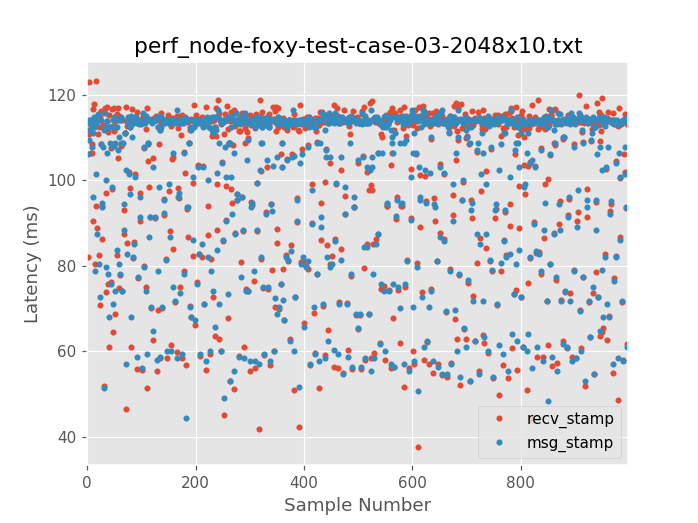
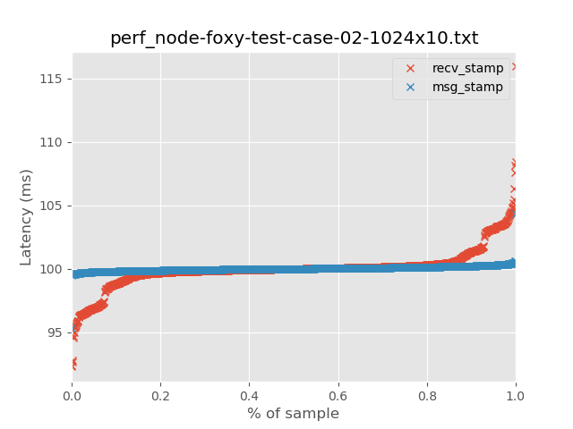
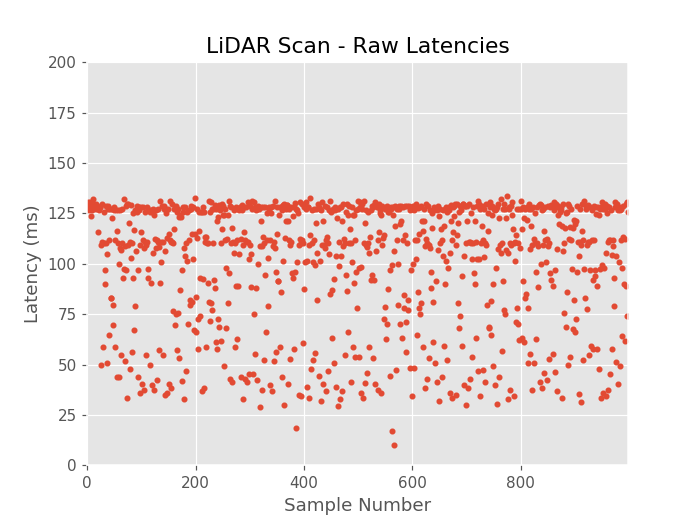

Ouster LiDAR Jitter Analysis in 2048x10 Mode
============================================
This document takes a quantitative look at jitter in the data delivery from an
Ouster OS1-16 LiDAR while run in `2048x10` mode.

# Introduction

We are using the [ROS2 Ouster
Drivers](https://github.com/SteveMacenski/ros2_ouster_drivers) to interface
with the LiDAR and our [perf_node](../include/ouster_perf/perf_node.hpp)
acts as our running application to consume and log these data used to conduct
our jitter analysis. An abstraction of our data model is shown in the figure
below.

<div style="text-align:center">


</div>

This work builds on our earlier work in looking at jitter and latency in using
the OS1-16 with ROS2 [Eloquent](./eloquent_perf.md) and
[Foxy](./foxy_perf.md). While conducting those analyses, we observed unstable
behavior in terms of jitter in the data delivery from the LiDAR when run in
`2048x10` mode. To get a sense of what we are seeing consider the plots
below. Our expectation is to recieve the scan data from the LiDAR at 10 Hz
(every 100 ms).

(The relevant traces on these plots are the blue traces. Each point represents
the elapsed time between a pair of successive scans. A complete explanation
of the analysis including numerical summary statistics associated to these
graphics is available [here](./eloquent_perf.md) and [here](./foxy_perf.md).).

## 2048x10 LiDAR Mode

### Raw Measurements

<div style="text-align:center">



</div>

### Quantile Plot

<div style="text-align:center">


</div>

## 1024x10 LiDAR Mode

Juxtapose to the `2048x10` data from above, when run in `1024x10` mode, the
LiDAR delivers data essentially *perfectly*. Plots from an exemplary data
collection of 1,000 scans in `1024x10` mode is shown below.

### Raw Measurements

<div style="text-align:center">


</div>

### Quantilie Plot

<div style="text-align:center">



</div>

The increased azimuth point density is critical to the applications that we
plan to employ the OS1-16 to help solve. Indeed, this increase in point density
further increases the amount of data the LiDAR needs to both capture and
deliver to the host-side software stack -- in our case the ROS2 stack pictured
above. The purpose of this document is to try to get a better understanding of
what is happening on the data link between the LiDAR and the host computer as
well as what is happening *inside* of the LiDAR (to the best of our
ability). Hopefully the output of this document can be used to help facilitate
a discussion with Ouster and to work in cooperation with them to fix this
problem.

# Preliminaries

To establish some context, my test setup and assumptions are as follows.

I'm using a Thinkpad T480 running Ubuntu 20.04 LTS with the 5.4.x low latency
Linux kernel.

```
$ uname  -a
Linux jelly 5.4.0-37-lowlatency #41-Ubuntu SMP PREEMPT Wed Jun 3 19:52:07 UTC 2020 x86_64 x86_64 x86_64 GNU/Linux
```

The hardware is 64-bit Quad core i7 hyperthreaded @ 1.9 GHz (8
virtual cores), 32 GB of RAM, NVIDIA GeForce MX150/PCIe/SSE2 discrete GPU, 1 TB
SSD.  The LiDAR under test is an Ouster OS1-16. The computer and LiDAR are
hard-wired directly over Gig Ethernet (no wifi, no switches, etc.) The specs on
my laptop are outlined in the figure below. In my setup, my computer is at
`192.168.0.92` and the LiDAR is at `192.168.0.254`.

<div style="text-align:center">


</div>

The LiDAR is running firmware version `v1.13.0`:

```
$ curl -s http://192.168.0.254/api/v1/system/firmware | jq
{
  "fw": "ousteros-image-prod-aries-v1.13.0-20191105025459"
}
```

I'm using ROS2 Foxy and unless explicitly specified below, the RMW
implementation in usage is
[Eclipse Cyclone DDS](https://github.com/eclipse-cyclonedds/cyclonedds)
(`rmw_cyclonedds_cpp`). Also, unless explicitly specified below,
[this](../etc/cyclonedds.xml) is the Eclipse Cyclone DDS configuration I am
using. **NOTE:** for most of this work, the ROS2 DDS middleware implementation
is irrelavant, as the measurements being looked at are taken outside of the
ROS2 infrastructure. The data flow diagram below should make that clear.

Some of the analysis shown below may rely upon consistent timing between the
LiDAR and my computer. They are time-synchronized using PTP as described
[here](../../ouster_ptp/). You can see the type of clock sync performance I am
getting by looking at a set of representative notebooks. My PTP performance is
shown [here](../../ouster_ptp/doc/notebooks/offset_from_master.ipynb) and the
system clock sync performance is shown
[here](../../ouster_ptp/doc/notebooks/sysclk.ipynb). I'll assert that the
system clock between the LiDAR and my computer are sub-millisecond and at worst
single-digit millisecond synchronized.

Since data from the Ouster are sent via UDP unicast, our socket
receive buffer sizes are relevant. On my machine they are set to 25 MB
(`26214400. / 2**20 -> 25.0`):

```
$ sysctl net.core.rmem_max
net.core.rmem_max = 26214400

$ sysctl net.core.rmem_default
net.core.rmem_default = 26214400
```

Finally, my Ethernet interace that is connected to the LiDAR is using the Linux
default MTU of `1500` bytes. I had run some tests with *jumbo frames* enabled
and surprisingly discovered that performance between my computer and LiDAR
actually got worse. This was surprising and something that warrants further
investigation. However, for now, we use the default MTU. See
[this](./foxy_perf.md#test-case-3) analysis using `1500` MTU vs
[this](./foxy_perf.md#test-case-4) analysis using `9000` MTU.

# Data Flow Model

In the analysis that follows, we use the following data flow
model. Specifically, we point out that scan data are being stamped at the point
of reception within the ROS2 Ouster driver. We use this timepoint to look at
the interscan latencies. Plotting these data allow us to visualize the jitter
in data delivery between the LiDAR and host computer. To be clear, stamping the
data where we are in this data flow model supports the following:

1. Any overhead introduced by the ROS2 middleware does not apply as the driver
   recieves the LiDAR data via a standard Linux UDP socket;
2. Any skew in the data related to time sync between the computer and LiDAR
   does not apply, as the timestamp is from the computer's local clock.

<div style="text-align:center">


</div>

# LiDAR Latencies in 2048x10 Mode

To establish our baseline, we have collected 1,000 scans from an OS1-16 in
`2048x10` mode. The observed latencies are as follows:

<div style="text-align:center">



</div>

<div style="text-align:center">


</div>
