Ouster LiDAR Performance in ROS2 - Foxy
=======================================
This document builds on the work reported in the [Eloquent Performance
Analysis](./eloquent_perf.md) document. It takes a quantitative look at the
expected jitter and latency of using ROS2 Foxy on Ubuntu 20.04 with an Ouster
OS1-16 LiDAR.

Much of the background material reported in the [Eloquent Performance
Analysis](./eloquent_perf.md) document will not be repeated here. Please read
that document to understand the test setup and machine configuration.

# Quick Links

- [Test Case 1](#test-case-1): `1024x10`, `TIME_FROM_ROS_RECEPTION`
- [Test Case 2](#test-case-2): `1024x10`, `TIME_FROM_ROS_RECEPTION`, row-major order
- [Test Case 3](#test-case-3): `2048x10`, `TIME_FROM_ROS_RECEPTION`, row-major order

# Data Flow Model

In this document, we are focused on measuring performance inside the
[ros2_ouster_driver](https://github.com/SteveMacenski/ros2_ouster_drivers) and
the ROS2 software stack. To that end, our measurement points (unless otherwise
specified) follow the data flow model pictured below.

<div style="text-align:center">


</div>

# Test Cases

## Test Case 1

This test case is used to re-establish the baseline set in the [Eloquent Performance
Analysis](./eloquent_perf.md) document with the only difference being that we
are testing against the (at the time of this writing) new Foxy LTS release.

This is a duplicate of [Test Case 7](./eloquent_perf.md#test-case-7) from the
Eloquent analysis.

<table>
  <tr>
    <th>LiDAR Mode</th>
    <th>Topic</th>
  </tr>
  <tr>
    <th>1024x10</th>
    <th>/points</th>
  </tr>
</table>

### Jitter

Raw jitter:

<div style="text-align:center">


</div>

Quantile plot:

<div style="text-align:center">


</div>

Summary statistics (milliseconds):

<table>
  <tr>
    <th>Statistic</th>
    <th>recv_stamp</th>
    <th>msg_stamp</th>
  </tr>
  <tr>
    <td>count</td>
    <td>999</td>
    <td>999</td>
  </tr>
  <tr>
    <td>median</td>
    <td>99.997</td>
    <td>99.998</td>
  </tr>
  <tr>
    <td>mad</td>
    <td>0.205</td>
    <td>0.080</td>
  </tr>
  <tr>
    <td>mean</td>
    <td>99.978</td>
    <td>99.999</td>
  </tr>
  <tr>
    <td>std</td>
    <td>1.182</td>
    <td>0.149</td>
  </tr>
  <tr>
    <td>min</td>
    <td>89.683</td>
    <td>99.343</td>
  </tr>
  <tr>
    <td>max</td>
    <td>106.336</td>
    <td>100.562</td>
  </tr>
</table>


### End-to-End Latency

Raw:

<div style="text-align:center">


</div>


Quantile:

<div style="text-align:center">


</div>

Summary statistics (milliseconds):

<table>
  <tr>
    <th>Statistic</th>
    <th>End-to-end Latency</th>
  </tr>
  <tr>
    <td>count</td>
    <td>1000</td>
  </tr>
  <tr>
    <td>median</td>
    <td>9.160</td>
  </tr>
  <tr>
    <td>mad</td>
    <td>0.105</td>
  </tr>
  <tr>
    <td>mean</td>
    <td>9.224</td>
  </tr>
  <tr>
    <td>std</td>
    <td>1.203</td>
  </tr>
  <tr>
    <td>min</td>
    <td>3.164</td>
  </tr>
  <tr>
    <td>max</td>
    <td>30.226</td>
  </tr>
</table>

## Test Case 2

This is a duplicate of [Test Case 1](./foxy_perf.md#test-case-1) however, the
driver has an additional software patch to order the PointCloud data in
row-major order. This test case is being used to see how much of a performance
hit we take organizing the data in this way.

<table>
  <tr>
    <th>LiDAR Mode</th>
    <th>Topic</th>
  </tr>
  <tr>
    <th>1024x10</th>
    <th>/points</th>
  </tr>
</table>

### Jitter

Raw jitter:

<div style="text-align:center">

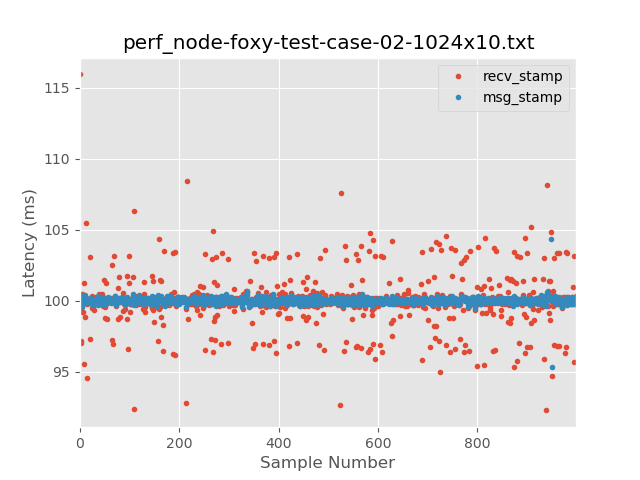

</div>

Quantile plot:

<div style="text-align:center">

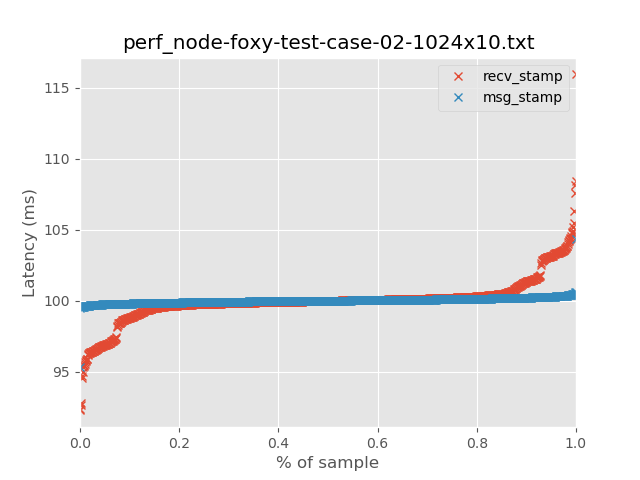

</div>

Summary statistics (milliseconds):

<table>
  <tr>
    <th>Statistic</th>
    <th>recv_stamp</th>
    <th>msg_stamp</th>
  </tr>
  <tr>
    <td>count</td>
    <td>999</td>
    <td>999</td>
  </tr>
  <tr>
    <td>median</td>
    <td>99.991</td>
    <td>100.000</td>
  </tr>
  <tr>
    <td>mad</td>
    <td>0.219</td>
    <td>0.101</td>
  </tr>
  <tr>
    <td>mean</td>
    <td>100.006</td>
    <td>100.000</td>
  </tr>
  <tr>
    <td>std</td>
    <td>1.626</td>
    <td>0.258</td>
  </tr>
  <tr>
    <td>min</td>
    <td>92.275</td>
    <td>95.364</td>
  </tr>
  <tr>
    <td>max</td>
    <td>115.926</td>
    <td>104.354</td>
  </tr>
</table>


### End-to-End Latency

Raw:

<div style="text-align:center">

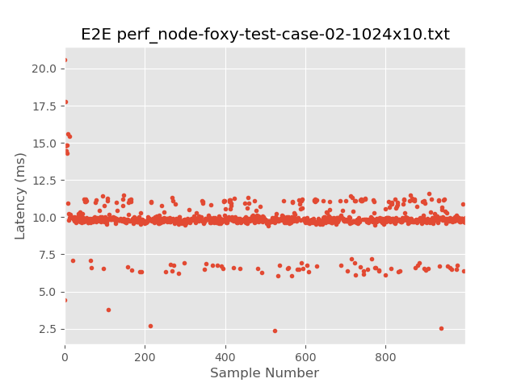

</div>


Quantile:

<div style="text-align:center">

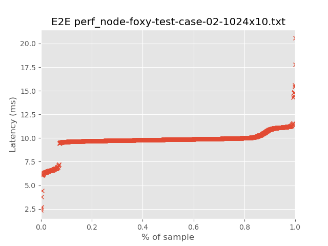

</div>

Summary statistics (milliseconds):

<table>
  <tr>
    <th>Statistic</th>
    <th>End-to-end Latency</th>
  </tr>
  <tr>
    <td>count</td>
    <td>1000</td>
  </tr>
  <tr>
    <td>median</td>
    <td>9.839</td>
  </tr>
  <tr>
    <td>mad</td>
    <td>0.119</td>
  </tr>
  <tr>
    <td>mean</td>
    <td>9.779</td>
  </tr>
  <tr>
    <td>std</td>
    <td>1.222</td>
  </tr>
  <tr>
    <td>min</td>
    <td>2.351</td>
  </tr>
  <tr>
    <td>max</td>
    <td>20.574</td>
  </tr>
</table>

## Test Case 3

We now look at the `2048x10` LiDAR mode. The parameterizations are the same as
above. The MTU on the NIC for this test case is the Linux default of `1500`
bytes.

<table>
  <tr>
    <th>LiDAR Mode</th>
    <th>Topic</th>
  </tr>
  <tr>
    <th>2048x10</th>
    <th>/points</th>
  </tr>
</table>

### Jitter

Raw jitter:

<div style="text-align:center">

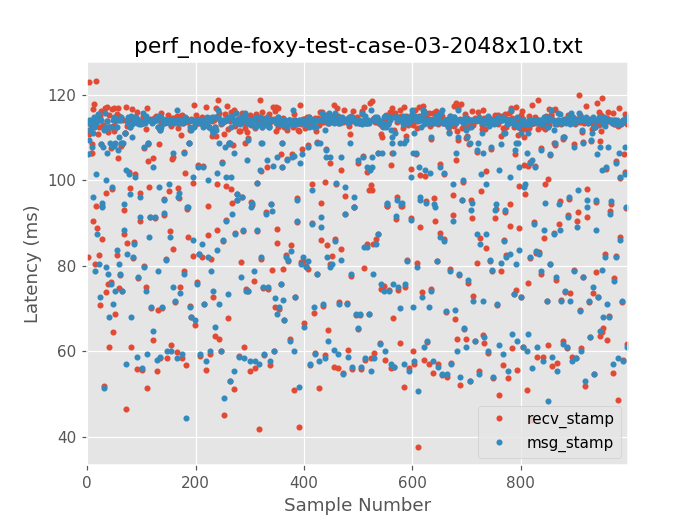

</div>

Quantile plot:

<div style="text-align:center">

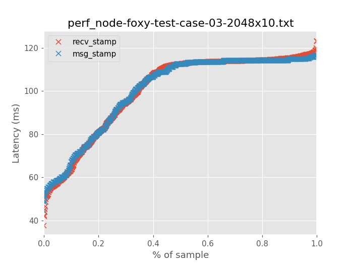

</div>

Summary statistics (milliseconds):

<table>
  <tr>
    <th>Statistic</th>
    <th>recv_stamp</th>
    <th>msg_stamp</th>
  </tr>
  <tr>
    <td>count</td>
    <td>999</td>
    <td>999</td>
  </tr>
  <tr>
    <td>median</td>
    <td>112.520</td>
    <td>112.490</td>
  </tr>
  <tr>
    <td>mad</td>
    <td>3.169</td>
    <td>2.380</td>
  </tr>
  <tr>
    <td>mean</td>
    <td>100.140</td>
    <td>100.164</td>
  </tr>
  <tr>
    <td>std</td>
    <td>20.019</td>
    <td>19.253</td>
  </tr>
  <tr>
    <td>min</td>
    <td>37.646</td>
    <td>44.543</td>
  </tr>
  <tr>
    <td>max</td>
    <td>123.289</td>
    <td>116.454</td>
  </tr>
</table>


### End-to-End Latency

Raw:

<div style="text-align:center">

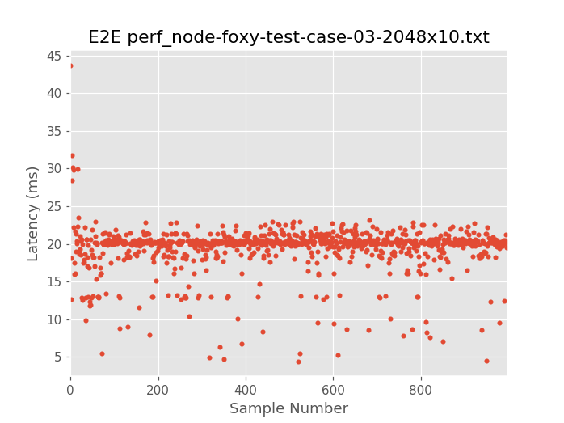

</div>


Quantile:

<div style="text-align:center">

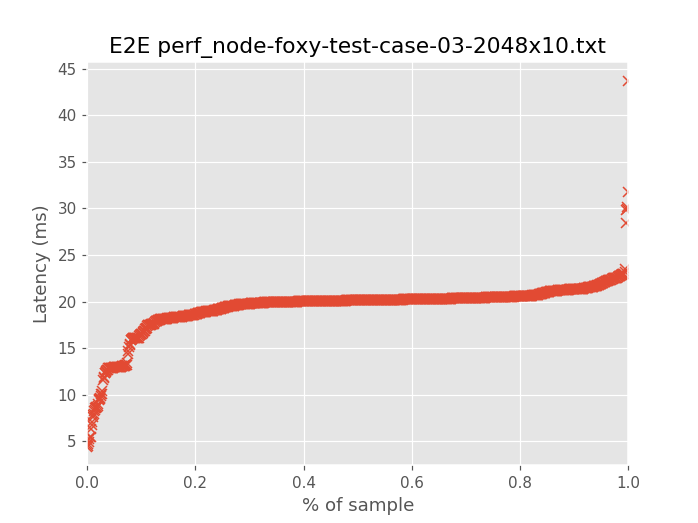

</div>

Summary statistics (milliseconds):

<table>
  <tr>
    <th>Statistic</th>
    <th>End-to-end Latency</th>
  </tr>
  <tr>
    <td>count</td>
    <td>1000</td>
  </tr>
  <tr>
    <td>median</td>
    <td>20.136</td>
  </tr>
  <tr>
    <td>mad</td>
    <td>0.406</td>
  </tr>
  <tr>
    <td>mean</td>
    <td>19.393</td>
  </tr>
  <tr>
    <td>std</td>
    <td>2.995</td>
  </tr>
  <tr>
    <td>min</td>
    <td>4.359</td>
  </tr>
  <tr>
    <td>max</td>
    <td>43.745</td>
  </tr>
</table>

## Test Case 4

This test is identical to Test Case 3, except, we turn on jumbo frames.

```
$ ip link show enp0s31f6
2: enp0s31f6: <BROADCAST,MULTICAST,UP,LOWER_UP> mtu 9000 qdisc fq_codel state UP mode DEFAULT group default qlen 1000
    link/ether e8:6a:64:f4:3c:5b brd ff:ff:ff:ff:ff:ff
```

<table>
  <tr>
    <th>LiDAR Mode</th>
    <th>Topic</th>
  </tr>
  <tr>
    <th>2048x10</th>
    <th>/points</th>
  </tr>
</table>

### Jitter

Raw jitter:

<div style="text-align:center">

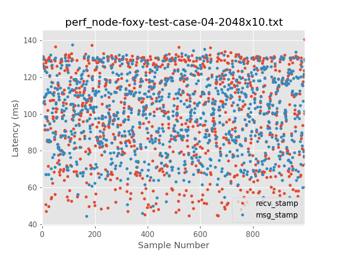

</div>

Quantile plot:

<div style="text-align:center">

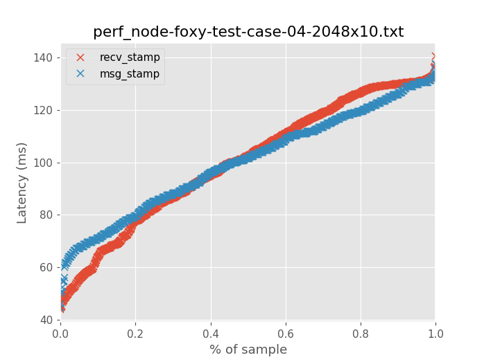

</div>

Summary statistics (milliseconds):

<table>
  <tr>
    <th>Statistic</th>
    <th>recv_stamp</th>
    <th>msg_stamp</th>
  </tr>
  <tr>
    <td>count</td>
    <td>999</td>
    <td>999</td>
  </tr>
  <tr>
    <td>median</td>
    <td>102.534</td>
    <td>101.580</td>
  </tr>
  <tr>
    <td>mad</td>
    <td>20.404</td>
    <td>16.390</td>
  </tr>
  <tr>
    <td>mean</td>
    <td>100.202</td>
    <td>100.183</td>
  </tr>
  <tr>
    <td>std</td>
    <td>24.603</td>
    <td>20.095</td>
  </tr>
  <tr>
    <td>min</td>
    <td>43.952</td>
    <td>44.548</td>
  </tr>
  <tr>
    <td>max</td>
    <td>140.660</td>
    <td>137.577</td>
  </tr>
</table>


### End-to-End Latency

Raw:

<div style="text-align:center">

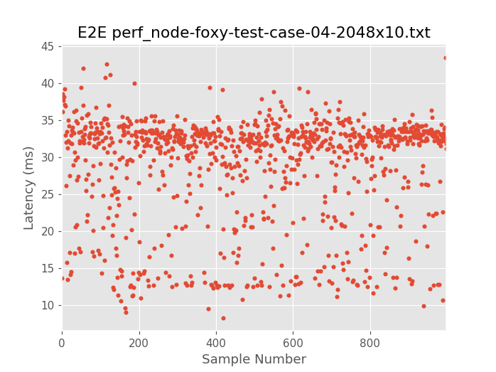

</div>


Quantile:

<div style="text-align:center">

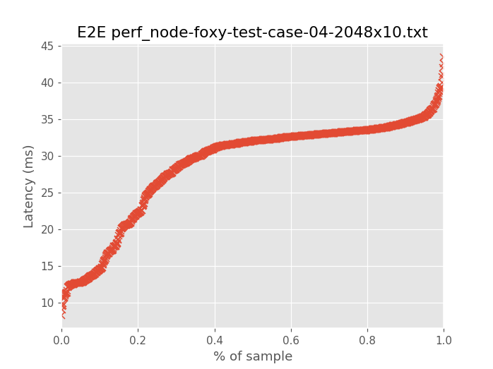

</div>

Summary statistics (milliseconds):

<table>
  <tr>
    <th>Statistic</th>
    <th>End-to-end Latency</th>
  </tr>
  <tr>
    <td>count</td>
    <td>1000</td>
  </tr>
  <tr>
    <td>median</td>
    <td>32.027</td>
  </tr>
  <tr>
    <td>mad</td>
    <td>2.011</td>
  </tr>
  <tr>
    <td>mean</td>
    <td>28.743</td>
  </tr>
  <tr>
    <td>std</td>
    <td>7.228</td>
  </tr>
  <tr>
    <td>min</td>
    <td>8.265</td>
  </tr>
  <tr>
    <td>max</td>
    <td>43.523</td>
  </tr>
</table>
