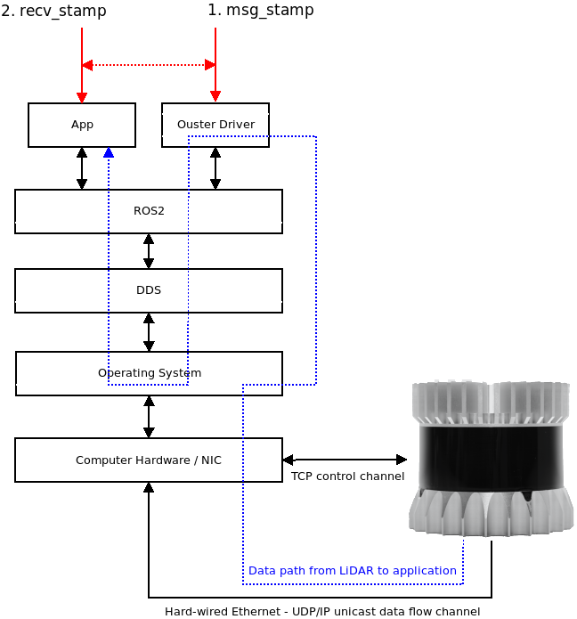

Ouster LiDAR Performance in ROS2 - Foxy
=======================================
This document builds on the work reported in the [Eloquent Performance
Analysis](./eloquent_perf.md) document. It takes a quantitative look at the
expected jitter and latency of using ROS2 Foxy with an Ouster OS1-16 LiDAR.

Much of the background material reported in the [Eloquent Performance
Analysis](./eloquent_perf.md) document will not be repeated here. Please read
that document to understand the test setup and machine configuration.

# Quick Links

- [Test Case 1](#test-case-1): `1024x10`, `TIME_FROM_ROS_RECEPTION`

# Data Flow Model

In the document, we are focused on measuring performance inside the
[ros2_ouster_driver](https://github.com/SteveMacenski/ros2_ouster_drivers) and
the ROS2 software stack. To that end, our measurement points (unless otherwise
specified) follow the data flow model pictured below.

# Test Cases

## Test Case 1

This test case is used to re-establish the baseline set in the [Eloquent Performance
Analysis](./eloquent_perf.md) document with the only difference being that we
are testing against the (at the time of this writing) new Foxy LTS release.

This is a duplicate of [Test Case 7](./eloquent_perf.md#test-case-7) from the
Eloquent analysis.

<table>
  <tr>
    <th>LiDAR Mode</th>
    <th>Topic</th>
  </tr>
  <tr>
    <th>1024x10</th>
    <th>/points</th>
  </tr>
</table>

### Jitter

Raw jitter:

Quantile plot:

Summary statistics (milliseconds):

<table>
  <tr>
    <th>Statistic</th>
    <th>recv_stamp</th>
    <th>msg_stamp</th>
  </tr>
  <tr>
    <td>count</td>
    <td>999</td>
    <td>999</td>
  </tr>
  <tr>
    <td>median</td>
    <td>99.997</td>
    <td>99.998</td>
  </tr>
  <tr>
    <td>mad</td>
    <td>0.205</td>
    <td>0.080</td>
  </tr>
  <tr>
    <td>mean</td>
    <td>99.978</td>
    <td>99.999</td>
  </tr>
  <tr>
    <td>std</td>
    <td>1.182</td>
    <td>0.149</td>
  </tr>
  <tr>
    <td>min</td>
    <td>89.683</td>
    <td>99.343</td>
  </tr>
  <tr>
    <td>max</td>
    <td>106.336</td>
    <td>100.562</td>
  </tr>
</table>

### End-to-End Latency

Raw:

Quantile:

Summary statistics (milliseconds):

<table>
  <tr>
    <th>Statistic</th>
    <th>End-to-end Latency</th>
  </tr>
  <tr>
    <td>count</td>
    <td>1000</td>
  </tr>
  <tr>
    <td>median</td>
    <td>9.160</td>
  </tr>
  <tr>
    <td>mad</td>
    <td>0.105</td>
  </tr>
  <tr>
    <td>mean</td>
    <td>9.224</td>
  </tr>
  <tr>
    <td>std</td>
    <td>1.203</td>
  </tr>
  <tr>
    <td>min</td>
    <td>3.164</td>
  </tr>
  <tr>
    <td>max</td>
    <td>30.226</td>
  </tr>
</table>
