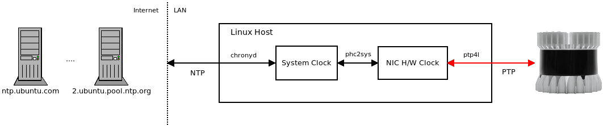
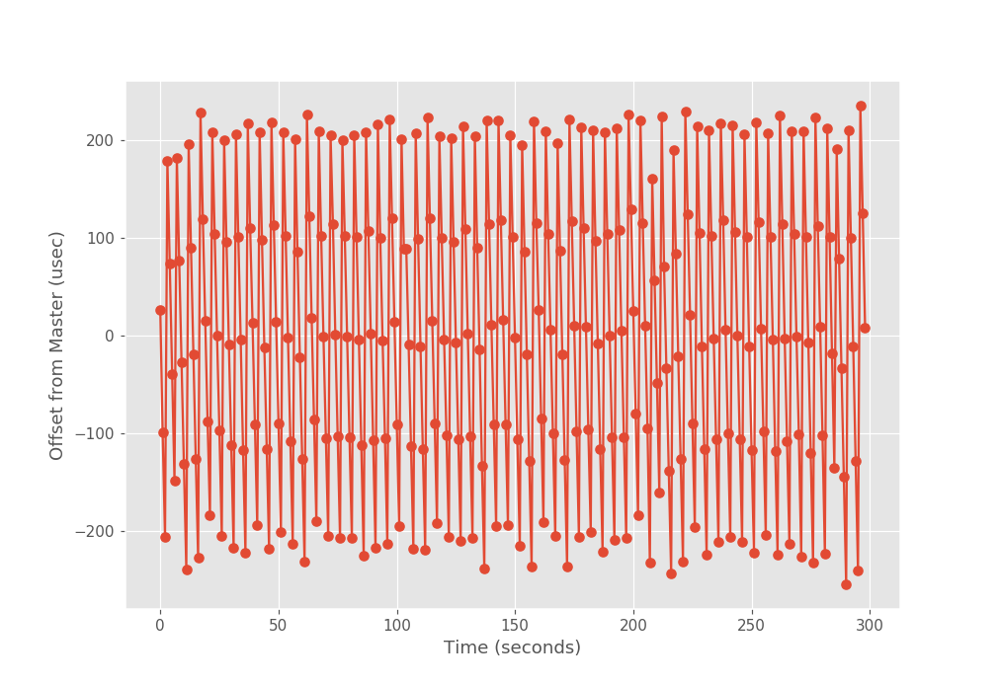

ouster_ptp
==========

This package provides tools for synchronizing the LiDAR clock to your local
`ptp4l` grandmaster clock using PTP. If you are using an external grandmaster,
where your local system and the LiDAR are to act as slaves, then this is *not*
the document for you.

- [Introduction](#introduction)
- [Identifying the HW Addresses](#identifying-the-hw-addresses)
- [LinuxPTP Daemon Configuration](#linuxptp-daemon-configuration)
- [Validating the PTP Nodes](#validating-the-ptp-nodes)
- [Assessing the PTP Time Sync](#assessing-the-ptp-time-sync)
- [Assessing the System Clock Time Sync](#assessing-the-system-clock-time-sync)

**NOTE:** Throughout this document we use the `jq` commandline tool to process
JSON on the command line. If you don't have that installed, we highly recommend
it: `sudo apt install jq`. We now assume you have it.

**NOTE:** We are not using `sudo` to run our `pmc` commands below. This is
because we set up our `ptp4l` permissions per the post-installation
instructions discussed [here](../README.md).


# Introduction

Modern robotics systems are distributed systems. Each node (computer, sensor,
actuator, etc.) typically has its own internal clock (sometimes several
clocks). Synchronizing these distributed clocks is required for proper
operation at a systems level. Ouster LiDARs natively support the [Precision
Time Protocol (PTP)](https://en.wikipedia.org/wiki/Precision_Time_Protocol) for
clock synchronization. Chapter 9 of the [Ouster Software
Guide](../ouster_perf/doc/ouster/software-user-guide-v1.13.0.pdf) provides a nice
overview of synchronizing an Ouster LiDAR with a Linux host that will act as
the PTP *grandmaster* clock. This guide builds on that document to help tune
such a setup. It is expected that the reader of this document has followed the
Ouster guide and is now in the tuning phase.

High-level overview of our exemplary clock architecture:

<center>



</center>

**NOTE:** Our focus in this document is to tune the PTP link (red).

Referring to the figure above, we have a single Ouster OS1-16 hard-wired
directly over ethernet into a Linux host running Ubuntu 18.04. The Linux host
synchronizes its local system clock with NTP servers on the Internet to set its
absolute wall clock time. This is managed with `chronyd`. The NIC on the host
(which supports hardware timestamping) has its clock synchronized to the local
system clock with `phc2sys`. Then a locally running `ptp4l` daemon instance
serves the NIC's hardware clock time as the root timing reference for the
network acting as the PTP grandmaster. In this case, our network is simply the
Linux host and the Ouster OS1-16.

Synchronizing the Linux host time to the NTP internet servers is not *strictly*
necessary. However, we prefer to have a good estimate of the wall clock time
for debugging across systems. For example, we may want to correlate log
messages generated on our robot to logs from an off-board fleet management
server or cloud service. We also note that if higher-precision absolute time is
needed, an external PTP grandmaster synchronized to GPS could/should be
used. However, for our example and many applications, using NTP like we show
above is sufficient. An excellent article on more accurate absolute time tuning
is available
[here](https://engineering.fb.com/production-engineering/ntp-service/).

The remainder of this document will assume a reasonable absolute wall clock
time on the local Linux host as obtained via NTP. To that end, our focus is on
tuning the PTP setup between the host and the LiDAR. To be clear, a
synchronized clock between our host and sensor is critical for running
algorithms that consume the LiDAR data and *assume good timestamps on the
point clouds*.


Identifying the HW Addresses
============================
The first thing we need to do before we can tune anything is to make sure we
can clearly discriminate between our host and the LiDAR as they will be
identified in the PTP network. Specifically, they will use the MAC addresses of
the ethernet adapters. So, let's resolve those.

Our Linux host has a wired ethernet interface `enp0s31f6` with the IP address
`192.168.0.92/24` bound to it.

```
$ ip addr show dev enp0s31f6
2: enp0s31f6: <NO-CARRIER,BROADCAST,MULTICAST,UP> mtu 1500 qdisc fq_codel state DOWN group default qlen 1000
    link/ether e8:6a:64:f4:3c:5b brd ff:ff:ff:ff:ff:ff
    inet 192.168.0.92/24 brd 192.168.0.255 scope global noprefixroute enp0s31f6
       valid_lft forever preferred_lft forever
    inet6 fe80::fe1f:f914:cc92:db5b/64 scope link tentative
       valid_lft forever preferred_lft forever
```

The OS1-16 has the IP address `192.168.0.254/24` as obtained from our
[dhcp_server](dhcp_server.md). Let's check general connectivity with
`ping`. From our Linux host:

```
$ ping 192.168.0.254
PING 192.168.0.254 (192.168.0.254) 56(84) bytes of data.
64 bytes from 192.168.0.254: icmp_seq=1 ttl=64 time=0.189 ms
64 bytes from 192.168.0.254: icmp_seq=2 ttl=64 time=0.141 ms
^C
```

Let's also look at our ARP cache so we can obtain the OS1-16 physical (MAC)
address:

```
$ arp -a
? (192.168.0.254) at bc:0f:a7:00:07:92 [ether] on enp0s31f6
```

OK. This is important. From the `ip` and `arp` commands above, we now have the
IP and MAC addresses of both our Linux host and OS1-16 resolved. For clarity,
in our example, they are:

<table>
  <tr>
       <th>Device</th>
       <th>IP Address</th>
       <th>MAC Address</th>
  </tr>
  <tr>
       <td>Linux Host</td>
       <td>192.168.0.92</td>
       <td>e8:6a:64:f4:3c:5b</td>
  </tr>
  <tr>
       <td>Ouster OS1-16</td>
       <td>192.168.0.254</td>
       <td>bc:0f:a7:00:07:92</td>
  </tr>
</table>


LinuxPTP Daemon Configuration
=============================
As stated earlier, the Ouster documentation covers the basics of setting up
`ptp4l` and `phc2sys`. For the sake of brevity, those instructions will not be
repeated. In this section will review some of the finer points.

The `ptp4l` daemon handles the actual PTP protocol specfics for us. Again, we
intend for our host to act as the grandmaster. So, we ensure that in our
`/etc/linuxptp/ptp4l.conf` we have the following parameters set (so it wins the
election vs the LiDAR to play the role of master):

```
slaveOnly               0
priority1               128
priority2               128
domainNumber            0
clockClass              128
```

We also want to ensure we are using hardware timestamping with:

```
time_stamping           hardware
```

At the very bottom of the `ptp4l.conf` file, we list our network
interface like (so we don't have to list it on the cmd line):

```
[enp0s31f6]
```

Finally, the contents of our
`/etc/systemd/system/ptp4l.service.d/override.conf` file looks like:

```
[Service]
ExecStart=
ExecStart=/usr/sbin/ptp4l -f /etc/linuxptp/ptp4l.conf
Group=ptp
```

Now we need to configure `phc2sys`. We want to tell it to take our system clock
(which obtains an absolute wall clock time via NTP using `chronyd`) and set the
NIC's PTP time to it and to keep it syncrhonized. To do that, we set the
contents of our `/etc/systemd/system/phc2sys.service.d/override.conf` file to:

```
[Service]
ExecStart=
ExecStart=/usr/sbin/phc2sys -w -u 60 -s CLOCK_REALTIME -c enp0s31f6
```

Now you can start both services in the usual way:

```
$ sudo systemctl daemon-reload
$ sudo systemctl stop phc2sys.service
$ sudo systemctl stop ptp4l.service
$ sudo systemctl start ptp4l.service
$ sudo systemctl start phc2sys.service
```

We can inspect our grandmaster settings using `pmc`:

```
$ pmc -u -i /var/tmp/pmc.sock -b 0 "GET GRANDMASTER_SETTINGS_NP"
sending: GET GRANDMASTER_SETTINGS_NP
	e86a64.fffe.f43c5b-0 seq 0 RESPONSE MANAGEMENT GRANDMASTER_SETTINGS_NP
		clockClass              128
		clockAccuracy           0xfe
		offsetScaledLogVariance 0xffff
		currentUtcOffset        36
		leap61                  0
		leap59                  0
		currentUtcOffsetValid   0
		ptpTimescale            1
		timeTraceable           0
		frequencyTraceable      0
		timeSource              0xa0
```

There is a problem. The `currentUtcOffset` is set to `36` which is
incorrect. As of Dec 31, 2016, [an additional leap second was added to the TAI
to UTC offset](https://en.wikipedia.org/wiki/International_Atomic_Time) so the
correct setting should be `37`. We can put that in place as well using `pmc`.

```
$ pmc -u -i /var/tmp/pmc.sock -b 0 "SET GRANDMASTER_SETTINGS_NP clockClass 128 clockAccuracy 0xfe offsetScaledLogVariance 0xffff currentUtcOffset 37 leap61 0 leap59 0 currentUtcOffsetValid 1 ptpTimescale 1 timeTraceable 1 frequencyTraceable 0 timeSource 0xa0"
sending: SET GRANDMASTER_SETTINGS_NP
	e86a64.fffe.f43c5b-0 seq 0 RESPONSE MANAGEMENT GRANDMASTER_SETTINGS_NP
		clockClass              128
		clockAccuracy           0xfe
		offsetScaledLogVariance 0xffff
		currentUtcOffset        37
		leap61                  0
		leap59                  0
		currentUtcOffsetValid   1
		ptpTimescale            1
		timeTraceable           1
		frequencyTraceable      0
		timeSource              0xa0
```

Validating the PTP Nodes
========================
Let's now see how the PTP nodes are configured:

```
$ pmc -u -i /var/tmp/pmc.sock -b 1 'GET CURRENT_DATA_SET'
sending: GET CURRENT_DATA_SET
	e86a64.fffe.f43c5b-0 seq 0 RESPONSE MANAGEMENT CURRENT_DATA_SET
		stepsRemoved     0
		offsetFromMaster 0.0
		meanPathDelay    0.0
	bc0fa7.fffe.000792-1 seq 0 RESPONSE MANAGEMENT CURRENT_DATA_SET
		stepsRemoved     1
		offsetFromMaster -171933.0
		meanPathDelay    20575.0
```

We can see from above that our Linux host `e86a64.fffe.f43c5b-0` is acting as
the master and the OS1-16 `bc0fa7.fffe.000792-1` is not. As indicated by the
`stepsRemoved` the OS1-16 is `1` communication hop from the master (our Linux
host) as we expect. Let's get some more information:

```
$ pmc -u -i /var/tmp/pmc.sock -b 1 'GET TIME_STATUS_NP'
sending: GET TIME_STATUS_NP
	e86a64.fffe.f43c5b-0 seq 0 RESPONSE MANAGEMENT TIME_STATUS_NP
		master_offset              0
		ingress_time               0
		cumulativeScaledRateOffset +0.000000000
		scaledLastGmPhaseChange    0
		gmTimeBaseIndicator        0
		lastGmPhaseChange          0x0000'0000000000000000.0000
		gmPresent                  false
		gmIdentity                 e86a64.fffe.f43c5b
	bc0fa7.fffe.000792-1 seq 0 RESPONSE MANAGEMENT TIME_STATUS_NP
		master_offset              -167079
		ingress_time               1586552465515858167
		cumulativeScaledRateOffset +0.000000000
		scaledLastGmPhaseChange    0
		gmTimeBaseIndicator        0
		lastGmPhaseChange          0x0000'0000000000000000.0000
		gmPresent                  true
		gmIdentity                 e86a64.fffe.f43c5b
```

For our Linux host `e86a64.fffe.f43c5b-0` we see that `gmPresent` being `false`
indicating that it is the grandmaster clock and validated with the `gmIdentity`
being its own Id. For the OS1-16 `bc0fa7.fffe.000792-1` we see that `gmPresent`
is `true` indicating that the local clock on the LiDAR is *not* acting as the
grandmaster and that the grandmaster it is using, as shown by the `gmIdentity`
is our Linux host. This can be further validated by using the OS1-16 HTTP API.

Validate the OS1-16 is not acting as the grandmaster:

```
$ curl -s http://192.168.0.254/api/v1/system/time/ptp | jq .port_data_set.port_state
"SLAVE"
```

Validate it is using our Linux host as the master:

```
$ curl -s http://192.168.0.254/api/v1/system/time/ptp | jq .parent_data_set.grandmaster_identity
"e86a64.fffe.f43c5b"
```

We can now conclude that our PTP architecture is setup correctly. Our Linux
host is the acting PTP grandmaster. The Ouster is a PTP slave and acknowledges
that our Linux host is its PTP master. We now focus on tuning the
synchronization of the clocks.

Assessing the PTP Time Sync
===========================
As a preliminary here, let's make sure the Ouster is using PTP as its
`timestamp_mode`:

```
$ nc 192.168.0.254 7501
set_config_param timestamp_mode TIME_FROM_PTP_1588
set_config_param
reinitialize
reinitialize
write_config_txt
write_config_txt
^C
```

You can validate with:

```
$ curl -s http://192.168.0.254/api/v1/system/time/ | jq .sensor.timestamp.mode
"TIME_FROM_PTP_1588"
```

Let's get a general sense of how well the two clocks are synchronized:

```
$ pmc -u -i /var/tmp/pmc.sock -b 1 'GET CURRENT_DATA_SET'
sending: GET CURRENT_DATA_SET
	e86a64.fffe.f43c5b-0 seq 0 RESPONSE MANAGEMENT CURRENT_DATA_SET
		stepsRemoved     0
		offsetFromMaster 0.0
		meanPathDelay    0.0
	bc0fa7.fffe.000792-1 seq 0 RESPONSE MANAGEMENT CURRENT_DATA_SET
		stepsRemoved     1
		offsetFromMaster -181840.0
		meanPathDelay    13955.0
```

This shows that the LiDAR time is `-181840.0` nanoseconds out-of-sync with the
Linux host time. That is `-0.00018184` seconds which is sub-millisecond but
represents `-181.84` microseconds of estimated error. PTP is advertised to
achieve `1` microsecond (or better) synchronization (the Ouster advertising +/-
50 usecs), so, our `-181.84` seems pretty bad. More troubling, it does not seem
stable. Let's sample twice:

```
$ pmc -u -i /var/tmp/pmc.sock -b 1 'GET CURRENT_DATA_SET'
sending: GET CURRENT_DATA_SET
	e86a64.fffe.f43c5b-0 seq 0 RESPONSE MANAGEMENT CURRENT_DATA_SET
		stepsRemoved     0
		offsetFromMaster 0.0
		meanPathDelay    0.0
	bc0fa7.fffe.000792-1 seq 0 RESPONSE MANAGEMENT CURRENT_DATA_SET
		stepsRemoved     1
		offsetFromMaster -187200.0
		meanPathDelay    1230.0

$ pmc -u -i /var/tmp/pmc.sock -b 1 'GET CURRENT_DATA_SET'
sending: GET CURRENT_DATA_SET
	e86a64.fffe.f43c5b-0 seq 0 RESPONSE MANAGEMENT CURRENT_DATA_SET
		stepsRemoved     0
		offsetFromMaster 0.0
		meanPathDelay    0.0
	bc0fa7.fffe.000792-1 seq 0 RESPONSE MANAGEMENT CURRENT_DATA_SET
		stepsRemoved     1
		offsetFromMaster 204000.0
		meanPathDelay    23529.0

```

Our first sample shows an offset of `-187200.0` and our second an offset of
`204000.0`. It feels like we are oscillating around our setpoint of `0`. We
need a better way to measure and to understand how our system is behaving.

To collect the data we need for our analysis, we will use the
[pmc_node](./doc/pmc_node.md). Right now we are only interested in looking at the
`offsetFromMaster` and `meanPathDelay` so we will configure the `pmc_node` to
only send `GET CURRENT_DATA_SET` at 1 Hz. The `pmc_node` is
configured by editing the [pmc.yaml](./etc/pmc.yaml) file. You'll want to set
the `pmc_commands` parameter as follows:

```
pmc_commands: ["GET CURRENT_DATA_SET"]
```

Assuming you made the above change to the yaml file, you can now start the
node with:

```
$ ros2 launch ouster_ptp pmc_managed.launch.py
```

And you can check that the data are coming across as you expect by capturing
one message like:

```
$ ros2 run ouster_ptp ptp-dump --pretty -1 2>/dev/null
[
  {
    "GET CURRENT_DATA_SET": {
      "ptp_msgs": [
        {
          "current_data_set": {
            "meanPathDelay": "0.0",
            "offsetFromMaster": "0.0",
            "stepsRemoved": "0"
          },
          "ptp_header": {
            "action": "RESPONSE",
            "sequenceId": "1",
            "sourcePortIdentity": "e86a64.fffe.f43c5b-0"
          },
          "recv_stamp_ns": "1586610222017950803"
        },
        {
          "current_data_set": {
            "meanPathDelay": "-9742339.0",
            "offsetFromMaster": "-8068397568.0",
            "stepsRemoved": "1"
          },
          "ptp_header": {
            "action": "RESPONSE",
            "sequenceId": "1",
            "sourcePortIdentity": "bc0fa7.fffe.000792-1"
          },
          "recv_stamp_ns": "1586610222018210687"
        }
      ],
      "send_stamp_ns": "1586610222017560066"
    }
  }
]
```

We will now use this same `ptp-dump` command to log 5 minutes of data
to a file that we can use for offline analysis (optional).

```
$ timeout -s INT 300s ros2 run ouster_ptp ptp-dump 2>/dev/null | tee /tmp/ptp_json_log-00.txt
[{"GET CURRENT_DATA_SET":{"send_stamp_ns":"1586610947564269927","ptp_msgs":[{"recv_stamp_ns":"1586610947564518608","ptp_header":{"sourcePortIdentity":"e86a64.fffe.f43c5b-0","sequenceId":"11","action":"RESPONSE"},"current_data_set":{"stepsRemoved":"0","offsetFromMaster":"0.0","meanPathDelay":"0.0"}},{"recv_stamp_ns":"1586610947564772636","ptp_header":{"sourcePortIdentity":"bc0fa7.fffe.000792-1","sequenceId":"11","action":"RESPONSE"},"current_data_set":{"stepsRemoved":"1","offsetFromMaster":"26050.0","meanPathDelay":"-2901.0"}}]}}]
[{"GET CURRENT_DATA_SET":{"send_stamp_ns":"1586610948564207280","ptp_msgs":[{"recv_stamp_ns":"1586610948564571985","ptp_header":{"sourcePortIdentity":"e86a64.fffe.f43c5b-0","sequenceId":"12","action":"RESPONSE"},"current_data_set":{"stepsRemoved":"0","offsetFromMaster":"0.0","meanPathDelay":"0.0"}},{"recv_stamp_ns":"1586610948564788188","ptp_header":{"sourcePortIdentity":"bc0fa7.fffe.000792-1","sequenceId":"12","action":"RESPONSE"},"current_data_set":{"stepsRemoved":"1","offsetFromMaster":"-98994.0","meanPathDelay":"16587.0"}}]}}]

... remainder of output not shown for obvious reasons ...
```

Using this zero-argument version of `ptp-dump` we get a packed JSON
representation with the results of a single `poll` on one line. Leveraging
this, we can validate that we got our data samples at 1 Hz with:

```
$ cat /tmp/ptp_json_log-00.txt | wc -l
299
```

**NOTE:** We would have expected 300 lines but only got 299. This is likely
related to the time it took ROS to discover the publisher before receiving any
data. The `timeout` command knows nothing about ROS so could not accomodate for
that. We will live with only 299 samples.

Plotting the `offsetFromMaster` over the entire 5 minute sampling period
produces the following:



Our assertion was correct, we are wildly oscillating around the `0`
setpoint. The notebook used to produce the above plot is available
[here](./doc/notebooks/offset_from_master.ipynb).

TODO: Still investigating how to get this resolved. May need work on Ouster
side since it is the slave. Stay tuned...

Assessing the System Clock Time Sync
====================================

In a way similar to above, we want to see how well the Linux system time is
synchronized to the LiDAR system time. We have automated that with the
following command:

```
$ ros2 run ouster_ptp sys-time -1 | jq
{
  "system_time": "1587149751.906000376",
  "lidar_time": "1587149751.904213667"
}
```

We see they are synchronized to within a couple milliseconds. It is actually
better than that as there is no latency estimate here in making the http call
to get the Ouster data. We also note, you can run the `sys-time` script in a
batch mode as well if you want to log these data over time. For example:

```
$ ros2 run ouster_ptp sys-time --help
usage: sys-time [-h] [--ip IP] [--hz HZ] [-1]

Compare the local system time to the LiDAR system time

optional arguments:
  -h, --help  show this help message and exit
  --ip IP     LiDAR IP address (default: 192.168.0.254)
  --hz HZ     Frequency to poll timestamps (default: 1)
  -1, --one   Poll once and exit (default: False)

$ ros2 run ouster_tools sys-time --hz 2
{"system_time":"1587149800.866159678","lidar_time":"1587149800.864163160"}
{"system_time":"1587149801.391718388","lidar_time":"1587149801.389585495"}
{"system_time":"1587149801.916905642","lidar_time":"1587149801.914767981"}
{"system_time":"1587149802.441340685","lidar_time":"1587149802.439082861"}
{"system_time":"1587149802.965002298","lidar_time":"1587149802.963232040"}
{"system_time":"1587149803.489916086","lidar_time":"1587149803.487805128"}
^C
```

A notebook looking at the synchronization of my local system clock to the Ouster system
clock over a 5 minute period is available
[here](./doc/notebooks/sysclk.ipynb). Again, these data need to be considered a
*very rough* estimate as the method to acquire the times have a significant amount of
latency built in (e.g., making an http request to the LiDAR, then the LiDAR
needing to sample the time (and other stuff) then package up the results and
send it back).
