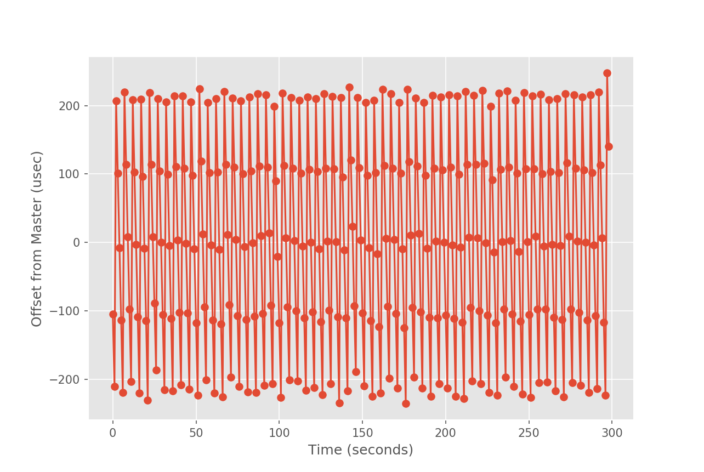

Performance Analysis
====================

This document attempts to help quantify the performance of using Ouster LiDARs
within ROS2. We have several objectives in developing this framework and set of
tools. They are:

1. To quantitatively understand the *current* performance characteristics that
   can be expected when using Ouster LiDARs in ROS2
2. To shine a light on any performance bottlenecks with the intention of giving
   a directed way to address the issues
3. To work toward an *optimized* ROS2 Ouster LiDAR technology stack

# Introduction

At [Box Robotics](http://boxrobotics.ai), we are rebuilding the AGV perception
stack in HD (see our website to understand what that means). To do this, we
believe long-range 3D LiDAR, like those produced by Ouster, are a critical
enabling technology. The application of this technology extends beyond what we
are doing at Box Robotics. 3D LiDAR generalizes to almost all autonomous mobile
robotics systems. The performance analysis work presented herein will be of
particular interest to those working on *higher-speed* mobile robots.

This is a living document. It is expected to be periodically updated as we
address any performance issues that this analsyis uncovers. The ROS2 stack for
interfacing with Ouster LiDARs is *deep*. To that end, for our purposes we will
create a simplified model of the various layers in this stack. Our model is
shown in the block diagram below.

<center>


</center>


In order to tune performance, we need to understand how data flow through this
set of *modules* and what free variables we have to play with at each layer. As
we *put our probes* on this system (i.e., take performance measurements) we
need to understand where in the stack the measurement is being sampled. This
allows us to focus our tuning efforts. In this document, we will do our best to
articulate our process.

# Preliminaries

To establish some context, my test setup and assumtions are as follows.

I'm using a Thinkpad T480 and an Ouster OS1-16. They are hard-wired directly
over Ethernet (no wifi, no switches, etc.) The specs on my laptop are outlined
in the figure below. In my setup, my computer is at `192.168.0.92` and the
LiDAR is at `192.168.0.254`.

<center>


</center>

The LiDAR is running firmware version `v1.13.0`:

```
$ curl -s http://192.168.0.254/api/v1/system/firmware | jq
{
  "fw": "ousteros-image-prod-aries-v1.13.0-20191105025459"
}
```

I'm using ROS2 Eloquent and unless explicitly specified below, the RMW
implementation in usage is
[Eclipse Cyclone DDS](https://github.com/eclipse-cyclonedds/cyclonedds)
(`rmw_cyclonedds_cpp`). The LiDAR driver in use is the one provided in the
[ros2_ouster_drivers](https://github.com/SteveMacenski/ros2_ouster_drivers)
package (the tip of the `eloquent-devel` branch).

Since much of the analysis shown below relies upon consistent timing, my
computer and the LiDAR are time-synchronized using PTP as described
[here](./ptp_tuning.md).

```
$ curl -s http://192.168.0.254/api/v1/system/time/ | jq .sensor.timestamp.mode
"TIME_FROM_PTP_1588"
```

As of this writing, I am getting (roughly) +/- 200 usec of accuracy between my
laptop and LiDAR. A representative sampling of the `offsetFromMaster` over 5
minutes at 1 Hz is shown in the figure below.

<center>



</center>

**NOTE:** I have an active request in with Ouster to expose some of the PTP
servo tuning parameters so we can eliminate this oscillation. Bottom-line, we
can assume sub-millisecond accuracy between the computer and LiDAR clocks for
the data reported herein.

Additionally, I have `phc2sys` running on my laptop keeping my system clock
synchronized to the PTP master clock on my NIC. Per the last statistic in the
system log, the RMS between my system clock and the PTP time (on the NIC) is
207 nanoseconds. We will consider them synchronized. This is important to note
as the ROS time (in some of our data collection code) will come from the local
system clock.

Finally, since data from the Ouster are sent via UDP unicast, our socket
receive buffer size is relevant. On my machine they are set as follows:

```
$ sysctl net.core.rmem_max
net.core.rmem_max = 26214400

$ sysctl net.core.rmem_default
net.core.rmem_default = 26214400
```

Which is 25 MB:

```
$ ipython3
Python 3.6.9 (default, Nov  7 2019, 10:44:02)
Type "copyright", "credits" or "license" for more information.

IPython 5.5.0 -- An enhanced Interactive Python.
?         -> Introduction and overview of IPython's features.
%quickref -> Quick reference.
help      -> Python's own help system.
object?   -> Details about 'object', use 'object??' for extra details.

In [1]: 26214400. / 2**20
Out[1]: 25.0
```

# Disclaimer

The author of this document is a Co-Founder of Box Robotics, Inc. and core
contributor to the ROS2 Ouster drivers. The author is not employed by
Ouster or any company that provides a DDS implementation for ROS2. This
analysis is actively funded entirely by Box Robotics whose only motivation in
doing this is (as stated earlier) to work toward an *optimized* ROS2 Ouster
LiDAR technology stack so we can build better robots.

We are open to feedback and discussion to help achieve our stated goals.

# Analysis

- [Jitter Analysis](#jitter-analysis)

## Jitter Analysis

In progress...
