Performance Analysis
====================

This document attempts to help quantify the performance of using Ouster LiDARs
within ROS2. We have several objectives in developing this framework and set of
tools. They are:

1. To quantitatively understand the performance characteristics that can be
   expected when using Ouster LiDARs in ROS2
2. To identify any performance bottlenecks with the intention of giving a
   directed way to address the issues
3. To work toward an *optimized* ROS2 Ouster LiDAR technology stack

# Quick Links

- [Test Case 1](#test-case-1): `2048x10`, `TIME_FROM_SYS_CLK`
- [Test Case 2](#test-case-2): `512x10`, `TIME_FROM_SYS_CLK`
- [Test Case 3](#test-case-3): `1024x10`, `TIME_FROM_SYS_CLK`
- [Test Case 4](#test-case-4): `1024x10`, `TIME_FROM_ROS_RECEPTION`
- [Test Case 5](#test-case-5): `1024x10`, `TIME_FROM_ROS_RECEPTION`, [cyclonedds.xml](../etc/cyclonedds.xml)


# Introduction

At [Box Robotics](http://boxrobotics.ai), we are rebuilding the AGV perception
stack in HD (see our website to understand what that means). To do this, we
believe long-range 3D LiDAR, like those produced by Ouster, are a critical
enabling technology. The application of this technology extends beyond what we
are doing at Box Robotics. 3D LiDAR generalizes to almost all autonomous mobile
robotics systems. The performance analysis work presented herein will be of
particular interest to those working on *higher-speed* mobile robots.

The ROS2 stack for interfacing with Ouster LiDARs is *deep*. To that end, for
our purposes we will create a simplified model of the various layers in this
stack. Our model is shown in the block diagram below.

<div style="text-align:center">


</div>


In order to tune performance, we need to understand how data flow through this
set of *modules* and what free variables we have to play with at each layer. As
we *put our probes* on this system we need to understand where in the stack the
measurement is being sampled. This allows us to focus our tuning efforts. In
this document, we will do our best to articulate our process.

# Preliminaries

To establish some context, my test setup and assumptions are as follows.

I'm using a Thinkpad T480 running Ubuntu 18.04 LTS with the 5.3.x low latency
Linux kernel.

```
$ uname  -a
Linux jelly 5.3.0-46-lowlatency #38~18.04.1-Ubuntu SMP PREEMPT Tue Mar 31 04:59:24 UTC 2020 x86_64 x86_64 x86_64 GNU/Linux
```

The hardware is 64-bit Quad core i7 hyperthreaded @ 1.9 GHz (8
virtual cores), 32 GB of RAM, NVIDIA GeForce MX150/PCIe/SSE2 discrete GPU, 1 TB
SSD.  The LiDAR under test is an Ouster OS1-16. The computer and LiDAR are
hard-wired directly over Gig Ethernet (no wifi, no switches, etc.) The specs on
my laptop are outlined in the figure below. In my setup, my computer is at
`192.168.0.92` and the LiDAR is at `192.168.0.254`.

<div style="text-align:center">


</div>

The LiDAR is running firmware version `v1.13.0`:

```
$ curl -s http://192.168.0.254/api/v1/system/firmware | jq
{
  "fw": "ousteros-image-prod-aries-v1.13.0-20191105025459"
}
```

I'm using ROS2 Eloquent and unless explicitly specified below, the RMW
implementation in usage is
[Eclipse Cyclone DDS](https://github.com/eclipse-cyclonedds/cyclonedds)
(`rmw_cyclonedds_cpp`). Also, unless explicitly specified below, the Eclipse
Cyclone DDS configuration I am using is the stock default shipped with the
Eloquent ROS2 distribution. The ROS2 LiDAR driver in use is the one provided in
the [ros2_ouster_drivers](https://github.com/SteveMacenski/ros2_ouster_drivers)
package.

**TODO:** Push a branch to baseline the code I used for measuring performance.

Since much of the analysis shown below relies upon consistent timing, my
computer and the LiDAR are time-synchronized using PTP as described
[here](./ptp_tuning.md). You can see the type of clock sync performance I am
getting by looking at a set of representative notebooks. My PTP performance is
shown [here](./notebooks/offset_from_master.ipynb) and the system clock sync
performance is shown [here](./notebooks/sysclk.ipynb). I'll assert that the
system clock between the LiDAR and my computer are sub-millisecond and at worst
single-digit millisecond synchronized.

Finally, since data from the Ouster are sent via UDP unicast, our socket
receive buffer sizes are relevant. On my machine they are set to 25 MB
(`26214400. / 2**20 -> 25.0`):

```
$ sysctl net.core.rmem_max
net.core.rmem_max = 26214400

$ sysctl net.core.rmem_default
net.core.rmem_default = 26214400
```

# Analysis

To collect data for our analysis, we will use the
[perf_node](./perf_node.md). The `perf_node` acts as our ROS2
application. Additionally, we need to run the ROS2 driver as the data source
for `perf_node`.

For this analysis, I am interested in quantifying both jitter and latency. In
terms of jitter, we look at jitter in when the data are stamped (`msg_stamp`)
and jitter when data are received (`recv_stamp`). We look at these
independently. Then we consider end-to-end (e2e) latency (`recv_stamp -
msg_stamp`). The methods in doing this analysis are inspired by the performance
analysis described in [this
whitepaper](http://wiki.zeromq.org/whitepapers:measuring-jitter) by the Zmq
team and by [this
work](https://github.com/ifm/ifm3d/blob/master/doc/jitter/jitter.ipynb) that I
peformed when I was leading the development of the [ifm3d
SDK](https://github.com/ifm/ifm3d).

The summary statistic I am most interested in is the median absolute deviation
(MAD) for any given metric. The MAD gives us the most typical deviation from
the most typical measurement. For us, we can use it to say: *the most typical
deviation from the most typical latency of X ms will be Y ms* (where X is the
median and Y is the mad).

I also use quantile plots below. For clarity in interpreting the data, for the
first quantile plot presented, I will explain how to read it.

I am using [this notebook](./notebooks/perf.ipynb) to analyze the collected
data and generate the plots shown below.

## Test Case 1

<table>
  <tr>
    <th>LiDAR Mode</th>
    <th>Topic</th>
  </tr>
  <tr>
    <th>2048x10</th>
    <th>/points</th>
  </tr>
</table>

The measurement points in our dataflow model are:

<div style="text-align:center">


</div>

Referring to the figure above, the data log we generate with `perf_node` will
reflect (1) `msg_stamp` which is taken at the LiDAR using the LiDAR system time
and (2) `recv_stamp` which is taken in the `perf_node` using the ROS2 system
time on the local computer. Recall, the clocks are synced to sub-millisecond
accuracy.

The ROS2 driver parameterization for this run looks like:

```
ouster_driver:
  ros__parameters:
    lidar_ip: 192.168.0.254
    computer_ip: 192.168.0.92
    lidar_mode: "2048x10"
    imu_port: 7503
    lidar_port: 7502
    sensor_frame: laser_sensor_frame
    laser_frame: laser_data_frame
    imu_frame: imu_data_frame
    use_system_default_qos: False
    timestamp_mode: TIME_FROM_SYS_CLK
```

Start the driver:

```
$ ros2 launch ros2_ouster os1_launch.py params_file:=${HOME}/.params2/os1.yaml
```

Start the application:

```
$ ros2 run ouster_tools perf_node __log_level:=warn --ros-args -p n_samples:=1000
```

Here is a plot of the raw jitter measurements:

<div style="text-align:center">


</div>

Here is the quantile plot:

<div style="text-align:center">

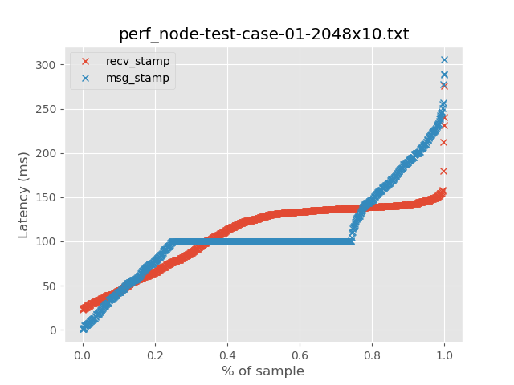

</div>

For clarity on how to read a quantile plot in the context of this analysis, the
question we want to answer is: What is the worst latency to expect in N% of the
cases? To do that, you look along the horizontal axis to pick N, then go up the
vertical axis to get the answer.

Summary statistics (milliseconds):

<table>
  <tr>
    <th>Statistic</th>
    <th>recv_stamp</th>
    <th>msg_stamp</th>
  </tr>
  <tr>
    <td>count</td>
    <td>999</td>
    <td>999</td>
  </tr>
  <tr>
    <td>median</td>
    <td>128.173710</td>
    <td>100.001024</td>
  </tr>
  <tr>
    <td>mad</td>
    <td>14.007318</td>
    <td>3.064064</td>
  </tr>
  <tr>
    <td>mean</td>
    <td>108.398984</td>
    <td>108.114248</td>
  </tr>
  <tr>
    <td>std</td>
    <td>38.794810</td>
    <td>52.254586</td>
  </tr>
  <tr>
    <td>min</td>
    <td>22.503929</td>
    <td>0.781056</td>
  </tr>
  <tr>
    <td>max</td>
    <td>275.481479</td>
    <td>305.468160</td>
  </tr>
</table>

Looking at the data above, neither signal (jitter on the LiDAR side or jitter
on the host side) are as clean as we would like to see. However, the LiDAR side
is much more stable with the most typical jitter being 100 ms +/- 3 ms (this is
pretty much what we expect when producing data at 10 Hz). However, on the local
host side and through our ROS2 stack, things look much worse. We should expect
to see 128 ms +/- 14 ms of jitter on the receiving side of our ROS2
application.

We now consider the end-to-end latency in the system. The raw measurements are:

<div style="text-align:center">


</div>

Here is the quantile plot:

<div style="text-align:center">

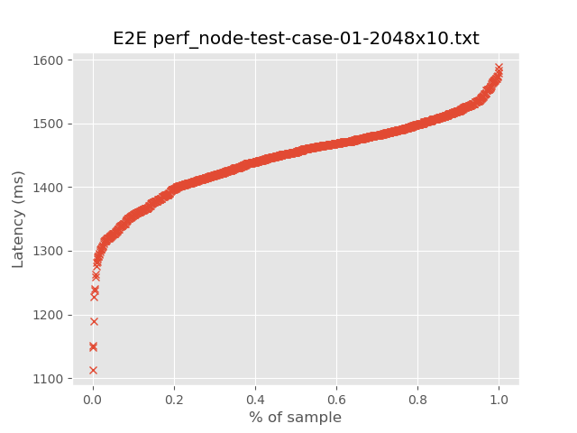

</div>

Summary statistics (milliseconds):

<table>
  <tr>
    <th>Statistic</th>
    <th>End-to-end Latency</th>
  </tr>
  <tr>
    <td>count</td>
    <td>1000</td>
  </tr>
  <tr>
    <td>median</td>
    <td>1455.071605</td>
  </tr>
  <tr>
    <td>mad</td>
    <td>39.68772</td>
  </tr>
  <tr>
    <td>mean</td>
    <td>1445.436221</td>
  </tr>
  <tr>
    <td>std</td>
    <td>65.088995</td>
  </tr>
  <tr>
    <td>min</td>
    <td>1112.398694</td>
  </tr>
  <tr>
    <td>max</td>
    <td>1588.455797</td>
  </tr>
</table>

This is concerning. In this configuration, we can expect to see an end-to-end
latency of 1455 ms +/- 40. Almost 1.5 seconds of end-to-end system latency!!

## Test Case 2

<table>
  <tr>
    <th>LiDAR Mode</th>
    <th>Topic</th>
  </tr>
  <tr>
    <th>512x10</th>
    <th>/points</th>
  </tr>
</table>

I'm curious to see if the performance issues we see in [Test Case
1](test-case-1) are as a result of the amount of data we are pushing through
the system. So, to that end, let's look at exactly the same test but in
`lidar_mode = 512x10`.

Since our measurement points are the same as in [Test Case 1](test-case-1) I
will not repeat that graphic here.

The ROS2 driver parameterization is:

```
ouster_driver:
  ros__parameters:
    lidar_ip: 192.168.0.254
    computer_ip: 192.168.0.92
    lidar_mode: "512x10"
    imu_port: 7503
    lidar_port: 7502
    sensor_frame: laser_sensor_frame
    laser_frame: laser_data_frame
    imu_frame: imu_data_frame
    use_system_default_qos: False
    timestamp_mode: TIME_FROM_SYS_CLK
```

I will also not repeat the commands for starting the driver and `perf_node` as
they are the same.

Here is a plot of the raw jitter measurements:

<div style="text-align:center">

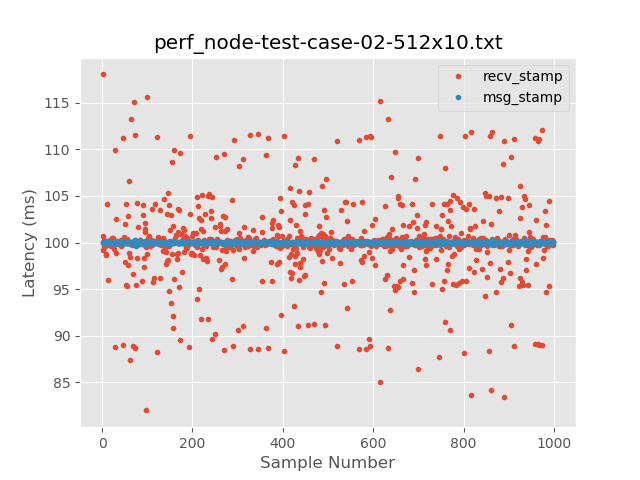

</div>

Here is the quantile plot:

<div style="text-align:center">

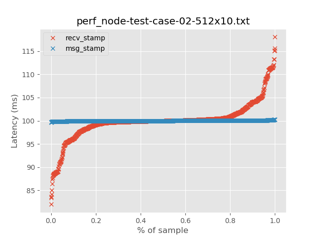

</div>

Summary statistics (milliseconds):

<table>
  <tr>
    <th>Statistic</th>
    <th>recv_stamp</th>
    <th>msg_stamp</th>
  </tr>
  <tr>
    <td>count</td>
    <td>999</td>
    <td>999</td>
  </tr>
  <tr>
    <td>median</td>
    <td>99.99</td>
    <td>99.99</td>
  </tr>
  <tr>
    <td>mad</td>
    <td>0.46</td>
    <td>0.043</td>
  </tr>
  <tr>
    <td>mean</td>
    <td>100.01</td>
    <td>99.99</td>
  </tr>
  <tr>
    <td>std</td>
    <td>4.003</td>
    <td>0.068</td>
  </tr>
  <tr>
    <td>min</td>
    <td>81.97</td>
    <td>99.67</td>
  </tr>
  <tr>
    <td>max</td>
    <td>118.057</td>
    <td>100.284</td>
  </tr>
</table>

These data are much more stable in terms of jitter. In fact the LiDAR side is
almost *perfect*. Let's now look at end-to-end latency.

Raw E2E jitter:

<div style="text-align:center">

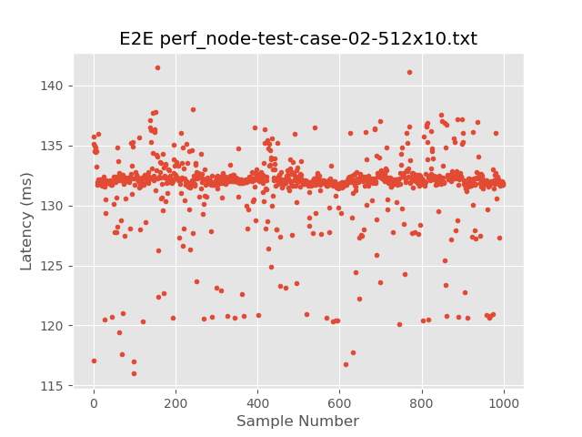

</div>

Here is the quantile plot:

<div style="text-align:center">

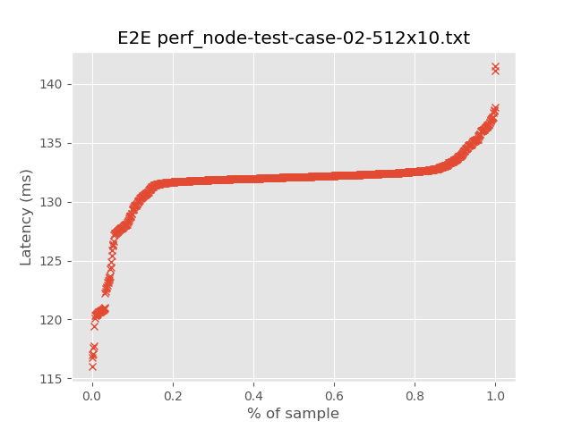

</div>

Summary statistics (milliseconds):

<table>
  <tr>
    <th>Statistic</th>
    <th>End-to-end Latency</th>
  </tr>
  <tr>
    <td>count</td>
    <td>1000</td>
  </tr>
  <tr>
    <td>median</td>
    <td>132.086</td>
  </tr>
  <tr>
    <td>mad</td>
    <td>0.327</td>
  </tr>
  <tr>
    <td>mean</td>
    <td>131.633</td>
  </tr>
  <tr>
    <td>std</td>
    <td>2.93</td>
  </tr>
  <tr>
    <td>min</td>
    <td>115.99</td>
  </tr>
  <tr>
    <td>max</td>
    <td>141.48</td>
  </tr>
</table>

These E2E numbers seem more reasonable (not great). We can expect to see e2e
latency of about 132 ms. It does seem like the amount of data we are pushing
through the system has a direct effect on our stability and latency.

## Test Case 3

<table>
  <tr>
    <th>LiDAR Mode</th>
    <th>Topic</th>
  </tr>
  <tr>
    <th>1024x10</th>
    <th>/points</th>
  </tr>
</table>

Since our measurement points are the same as in [Test Case 1](test-case-1) I
will not repeat that graphic here.

The ROS2 driver parameterization is:

```
ouster_driver:
  ros__parameters:
    lidar_ip: 192.168.0.254
    computer_ip: 192.168.0.92
    lidar_mode: "1024x10"
    imu_port: 7503
    lidar_port: 7502
    sensor_frame: laser_sensor_frame
    laser_frame: laser_data_frame
    imu_frame: imu_data_frame
    use_system_default_qos: False
    timestamp_mode: TIME_FROM_SYS_CLK
```

Here is a plot of the raw jitter measurements:

<div style="text-align:center">

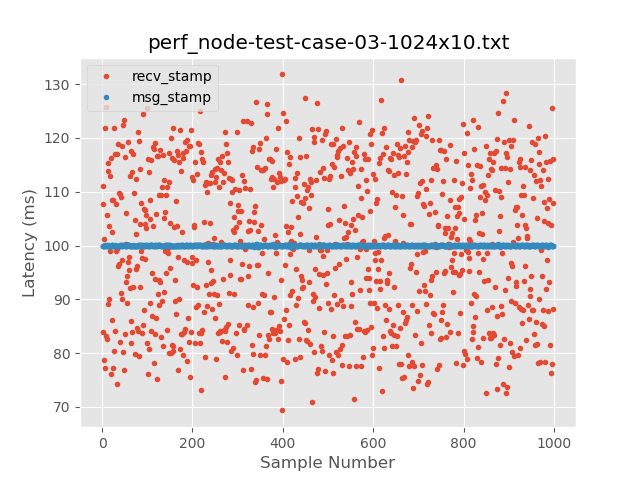

</div>

Here is the quantile plot:

<div style="text-align:center">

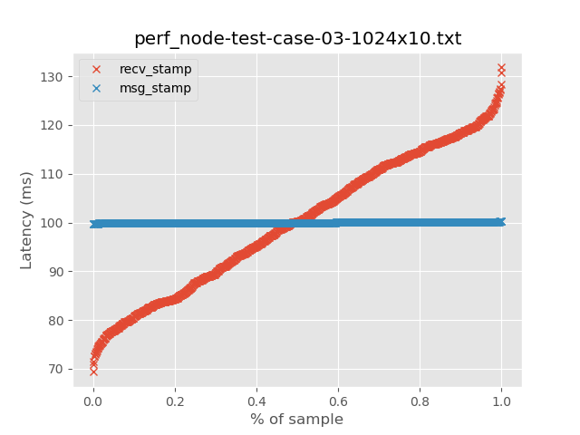

</div>

Summary statistics (milliseconds):

<table>
  <tr>
    <th>Statistic</th>
    <th>recv_stamp</th>
    <th>msg_stamp</th>
  </tr>
  <tr>
    <td>count</td>
    <td>999</td>
    <td>999</td>
  </tr>
  <tr>
    <td>median</td>
    <td>100.2</td>
    <td>99.99</td>
  </tr>
  <tr>
    <td>mad</td>
    <td>12.595</td>
    <td>0.042</td>
  </tr>
  <tr>
    <td>mean</td>
    <td>99.99</td>
    <td>100.00</td>
  </tr>
  <tr>
    <td>std</td>
    <td>14.29</td>
    <td>0.07</td>
  </tr>
  <tr>
    <td>min</td>
    <td>69.36</td>
    <td>99.72</td>
  </tr>
  <tr>
    <td>max</td>
    <td>131.823</td>
    <td>100.246</td>
  </tr>
</table>

Similar to Test Case 2, the LiDAR side is *perfect* while the host/ROS2 side is
concerning.

Raw E2E jitter:

<div style="text-align:center">

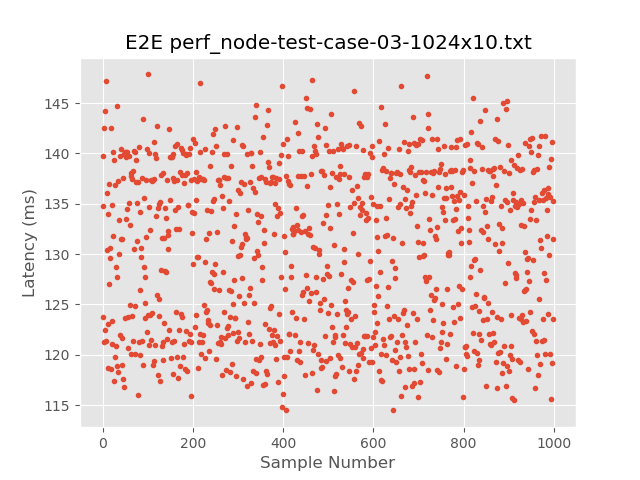

</div>

Here is the quantile plot:

<div style="text-align:center">


</div>

Summary statistics (milliseconds):

<table>
  <tr>
    <th>Statistic</th>
    <th>End-to-end Latency</th>
  </tr>
  <tr>
    <td>count</td>
    <td>1000</td>
  </tr>
  <tr>
    <td>median</td>
    <td>131.483</td>
  </tr>
  <tr>
    <td>mad</td>
    <td>7.144</td>
  </tr>
  <tr>
    <td>mean</td>
    <td>130.347</td>
  </tr>
  <tr>
    <td>std</td>
    <td>8.143</td>
  </tr>
  <tr>
    <td>min</td>
    <td>114.47</td>
  </tr>
  <tr>
    <td>max</td>
    <td>147.85</td>
  </tr>
</table>

## Test Case 4

<table>
  <tr>
    <th>LiDAR Mode</th>
    <th>Topic</th>
  </tr>
  <tr>
    <th>1024x10</th>
    <th>/points</th>
  </tr>
</table>

For this next test case, my objective is to see if the instability in the
system is rooted in the ROS2 Ouster driver or in traversing the ROS2 stack once
publishing the data from the driver. To get a sense of this, I am going to
change where I take my measurements by leveraging a feature of the ROS2 Ouster
driver. Specifically, we are going to stamp the messages with the
`TIME_FROM_ROS_RECEPTION`. The figure below depicts where on our dataflow
diagram the measurements will be taken.

<div style="text-align:center">


</div>


Since the LiDAR seemed to operate *perfectly* in the 1024x10 mode, I am going
to use that `lidar_mode` again for this test. If the data processing between
the LiDAR and the driver (including inside of the driver implementation) is
working well, we should see an (almost) identical jitter profile on the
`msg_stamp` analysis as we did in Test Case 3. Again, my objective in running
this test is to see if we need to focus our tuning efforts in the driver (and
how data flow into it) or in the ROS2 stack (once data are published from the
driver).

The ROS2 driver parameterization is:

```
ouster_driver:
  ros__parameters:
    lidar_ip: 192.168.0.254
    computer_ip: 192.168.0.92
    lidar_mode: "1024x10"
    imu_port: 7503
    lidar_port: 7502
    sensor_frame: laser_sensor_frame
    laser_frame: laser_data_frame
    imu_frame: imu_data_frame
    use_system_default_qos: False
    timestamp_mode: TIME_FROM_ROS_RECEPTION
```

Here is a plot of the raw jitter measurements:

<div style="text-align:center">

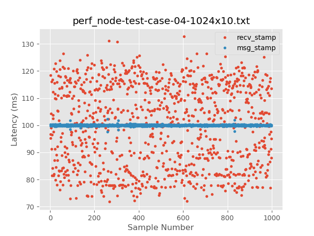

</div>

Here is the quantile plot:

<div style="text-align:center">

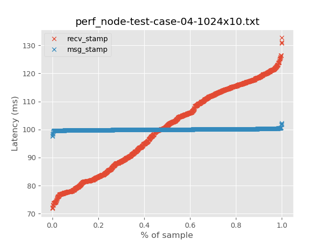

</div>

Summary statistics (milliseconds):

<table>
  <tr>
    <th>Statistic</th>
    <th>recv_stamp</th>
    <th>msg_stamp</th>
  </tr>
  <tr>
    <td>count</td>
    <td>999</td>
    <td>999</td>
  </tr>
  <tr>
    <td>median</td>
    <td>101.392</td>
    <td>100.002</td>
  </tr>
  <tr>
    <td>mad</td>
    <td>13.549</td>
    <td>0.129</td>
  </tr>
  <tr>
    <td>mean</td>
    <td>99.999</td>
    <td>100.000</td>
  </tr>
  <tr>
    <td>std</td>
    <td>15.042</td>
    <td>0.260</td>
  </tr>
  <tr>
    <td>min</td>
    <td>71.789</td>
    <td>97.634</td>
  </tr>
  <tr>
    <td>max</td>
    <td>132.708</td>
    <td>102.289</td>
  </tr>
</table>

While not *as perfect* as internal to the LiDAR, the publication jitter
emitting out from the ROS2 driver seems very stable. It is beginning to look
like the problem is the data flow path between the driver and the application,
i.e., the ROS2 middleware.

Raw E2E jitter:

<div style="text-align:center">

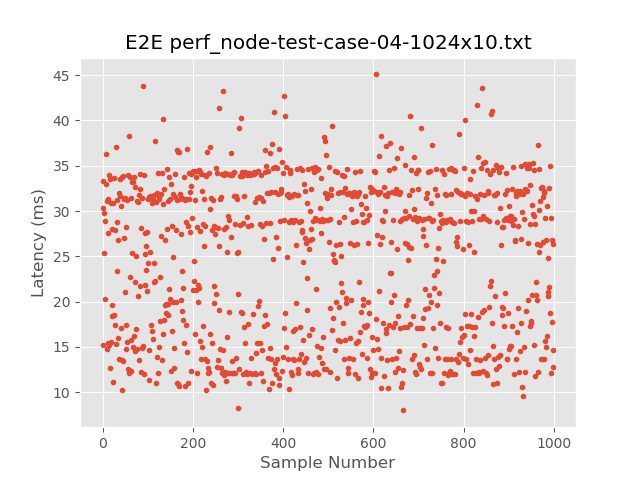

</div>

Here is the quantile plot:

<div style="text-align:center">

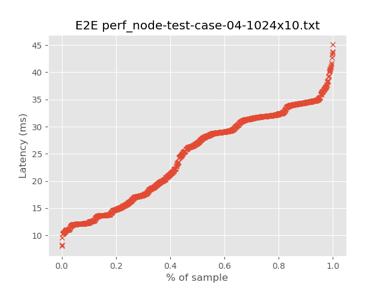

</div>

Summary statistics (milliseconds):

<table>
  <tr>
    <th>Statistic</th>
    <th>End-to-end Latency</th>
  </tr>
  <tr>
    <td>count</td>
    <td>1000</td>
  </tr>
  <tr>
    <td>median</td>
    <td>26.965</td>
  </tr>
  <tr>
    <td>mad</td>
    <td>7.145</td>
  </tr>
  <tr>
    <td>mean</td>
    <td>24.620</td>
  </tr>
  <tr>
    <td>std</td>
    <td>8.555</td>
  </tr>
  <tr>
    <td>min</td>
    <td>7.990</td>
  </tr>
  <tr>
    <td>max</td>
    <td>45.079</td>
  </tr>
</table>

**NOTE:** In the previous test cases when data were being stamped in the LiDAR,
it should be noted that the message stamp came from the first column firing in
the LiDAR. So, roughly 100 ms of the *absolute* E2E latency numbers being
reported in Test Cases 1 - Test Cases 3 (inclusive) included the latency
introduced by the actual measurement sweep of the LiDAR. In a separate
analysis, we will contemplate the times stamped on the points for a single
LiDAR sweep. The point of this analysis is to look at the jitter related to an
entire scan. So, while the numbers reported in this test case are smaller in
terms of absolute wall clock time / latency, they indicate that the
dominant factor in the jitter is the ROS2 middleware and not internal to
the LiDAR or driver.

## Test Case 5

<table>
  <tr>
    <th>LiDAR Mode</th>
    <th>Topic</th>
  </tr>
  <tr>
    <th>1024x10</th>
    <th>/points</th>
  </tr>
</table>

For this test I am duplicating the measurement point setup for Test Case 4 (so
`TIME_FROM_ROS_RECEPTION`) but we are taking a minimally invasive approach to
tuning the ROS2 middleware. Specifically, we set some parameters on the Eclipse
Cyclone DDS. The configuration file we are using looks like:

```
<?xml version="1.0" encoding="UTF-8" ?>
<CycloneDDS xmlns="https://cdds.io/config" xmlns:xsi="http://www.w3.org/2001/XMLSchema-instance" xsi:schemaLocation="https://cdds.io/config https://raw.githubusercontent.com/eclipse-cyclonedds/cyclonedds/master/etc/cyclonedds.xsd">
    <Domain id="any">
        <General>
            <NetworkInterfaceAddress>127.0.0.1</NetworkInterfaceAddress>
            <AllowMulticast>default</AllowMulticast>
            <MaxMessageSize>65536B</MaxMessageSize>
            <FragmentSize>32768B</FragmentSize>
        </General>
        <Internal>
            <Watermarks>
                <WhcHigh>500kB</WhcHigh>
            </Watermarks>
        </Internal>
        <Tracing>
            <Verbosity>none</Verbosity>
            <OutputFile>stdout</OutputFile>
        </Tracing>
    </Domain>
</CycloneDDS>
```

The ROS2 driver parameterization is:

```
ouster_driver:
  ros__parameters:
    lidar_ip: 192.168.0.254
    computer_ip: 192.168.0.92
    lidar_mode: "1024x10"
    imu_port: 7503
    lidar_port: 7502
    sensor_frame: laser_sensor_frame
    laser_frame: laser_data_frame
    imu_frame: imu_data_frame
    use_system_default_qos: False
    timestamp_mode: TIME_FROM_ROS_RECEPTION
```

This time, to start the driver:

```
$ CYCLONEDDS_URI=file://${HOME}/dev2/ros2-ouster-tools/ouster_tools/etc/cyclonedds.xml ros2 launch ros2_ouster os1_launch.py params_file:=${HOME}/.params2/os1.yaml
```

To start the `perf_node`:

```
$ CYCLONEDDS_URI=file://${HOME}/dev2/ros2-ouster-tools/ouster_tools/etc/cyclonedds.xml ros2 run ouster_tools perf_node  --ros-args --log-level WARN -p n_samples:=1000
```

**NOTE:** Be sure to point to wherever you have the `cyclonedds.xml` stored on
your filesystem.


Here is a plot of the raw jitter measurements:

<div style="text-align:center">

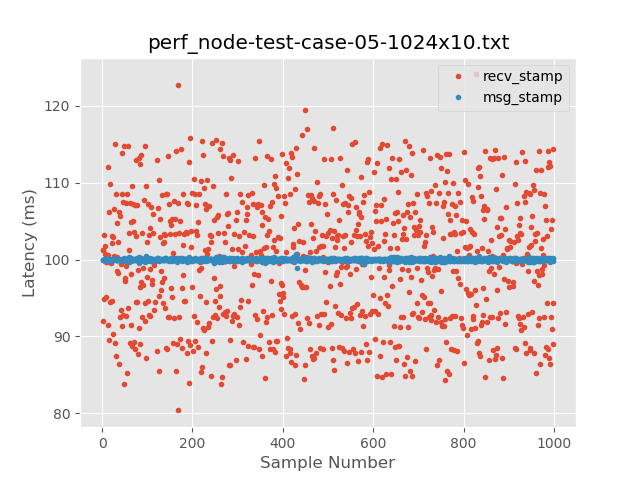

</div>

Here is the quantile plot:

<div style="text-align:center">

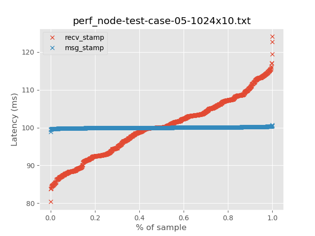

</div>

Summary statistics (milliseconds):

<table>
  <tr>
    <th>Statistic</th>
    <th>recv_stamp</th>
    <th>msg_stamp</th>
  </tr>
  <tr>
    <td>count</td>
    <td>999</td>
    <td>999</td>
  </tr>
  <tr>
    <td>median</td>
    <td>100.102</td>
    <td>99.99</td>
  </tr>
  <tr>
    <td>mad</td>
    <td>6.436</td>
    <td>0.075</td>
  </tr>
  <tr>
    <td>mean</td>
    <td>99.987</td>
    <td>100.001</td>
  </tr>
  <tr>
    <td>std</td>
    <td>8.009</td>
    <td>0.138</td>
  </tr>
  <tr>
    <td>min</td>
    <td>80.368</td>
    <td>98.923</td>
  </tr>
  <tr>
    <td>max</td>
    <td>124.105</td>
    <td>100.774</td>
  </tr>
</table>

Raw E2E jitter:

<div style="text-align:center">

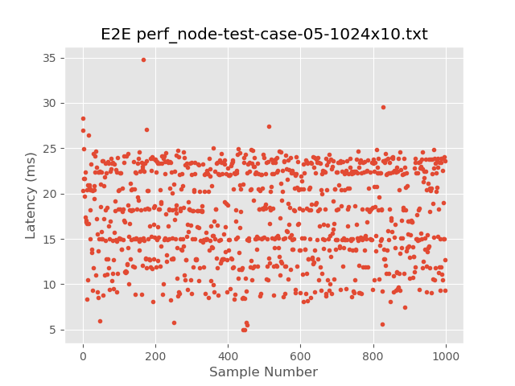

</div>

Here is the quantile plot:

<div style="text-align:center">

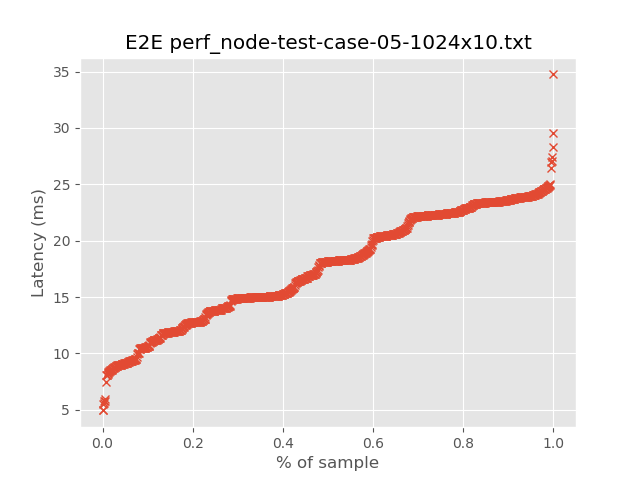

</div>

Summary statistics (milliseconds):

<table>
  <tr>
    <th>Statistic</th>
    <th>End-to-end Latency</th>
  </tr>
  <tr>
    <td>count</td>
    <td>1000</td>
  </tr>
  <tr>
    <td>median</td>
    <td>18.164</td>
  </tr>
  <tr>
    <td>mad</td>
    <td>4.256</td>
  </tr>
  <tr>
    <td>mean</td>
    <td>17.596</td>
  </tr>
  <tr>
    <td>std</td>
    <td>4.982</td>
  </tr>
  <tr>
    <td>min</td>
    <td>4.953</td>
  </tr>
  <tr>
    <td>max</td>
    <td>34.753</td>
  </tr>
</table>

We can see that we have made some non-insignificant improvements by tuning the
middleware like we have in this test case. However, we are still paying the
cost of serializing the point cloud - traversing the Linux network stack -
deserializing the point cloud. This is an unnecessary tax that we should not
have to incur.

The next steps I am going to look at (likely, Test Cases 6 and 7), are to
implement the driver as a ROS2 component and to see if I can get the
`rmw_iceoryx_cpp` (and its integration with Cyclone) working. The latter would
be ideal as we can continue to realize the modularity benefits of running ROS2
nodes as separate processes *and* the benefits of zero-copy. Both of these
approaches require some work, so, stay tuned....
