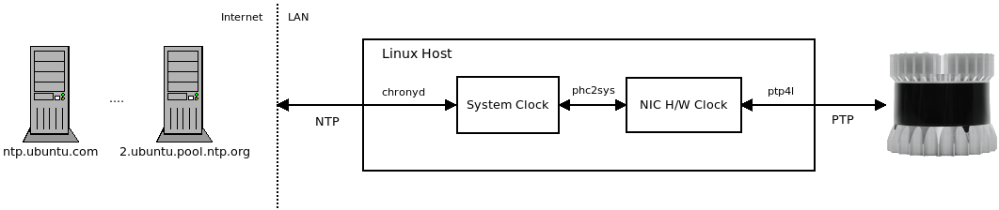

PTP Tuning
==========

This document covers synchronizing the LiDAR clock to your local system time
over PTP. It also includes some tips on PTP tuning.

- [Introduction](#introduction)
- [Validating the PTP Setup](#validating-the-ptp-setup)
- [Tuning the PTP clock sync between the host andLiDAR](#tuning-the-ptp-clock-sync-between-the-host-and-lidar)


# Introduction

Modern robotics systems are distributed systems. Each node (computer, sensor,
actuator, etc.) typically has its own internal clock (sometimes several
clocks). Synchronizing these distributed clocks is required for proper
operation at a systems level. Ouster LiDARs natively support the [Precision
Time Protocol (PTP)](https://en.wikipedia.org/wiki/Precision_Time_Protocol) for
clock synchronization. Chapter 9 of the [Ouster Software
Guide](ouster/software-user-guide-v1.13.0.pdf) provides a nice overview of
synchronizing an Ouster LiDAR with a Linux host that will act as the PTP
*grandmaster* clock. This guide builds on that document to help tune such a
setup. It is expected that the reader of this document has followed the Ouster
guide and is now in the tuning phase.

High-level overview of our exemplary clock architecture:



Referring to the figure above, we have a single Ouster OS1-16 hard-wired
directly over ethernet into a Linux host running Ubuntu 18.04. The Linux host
synchronizes its local system clock with NTP servers on the Internet to set its
absolute wall clock time. This is managed with `chronyd`. The NIC on the host
(which supports hardware timestamping) has its clock synchronized to the local
system clock with `phc2sys`. Then a locally running `ptp4l` daemon instance
serves the NIC's hardware clock time as the root timing reference for the
network acting as the PTP grandmaster. In this case, our network is simply the
Linux host and the Ouster OS1-16.

Synchronizing the Linux host time to the NTP internet servers is not *strictly*
necessary. However, we prefer to have a good estimate of the wall clock time
for debugging across systems. For example, we may want to correlate log
messages generated on our robot to logs from an off-board fleet management
server or cloud service. We also note that if higher-precision absolute time is
needed, an external PTP grandmaster synchronized to GPS could/should be
used. However, for our example and many applications, using NTP like we show
above is sufficient. An excellent article on more accurate absolute time tuning
is available
[here](https://engineering.fb.com/production-engineering/ntp-service/).

The remainder of this document will assume a reasonable absolute wall clock
time on the local Linux host as obtained via NTP. To that end, our focus is on
tuning the PTP setup between the host and the LiDAR. To be clear, a
synchronized clock between our host and sensor is critical for running
algorithms that consume the LiDAR data *assuming good timestamps on the
point clouds*.

Validating the PTP Setup
========================
The first thing we need to do before we can tune anything is to validate our
PTP setup. Our Linux host has a wired ethernet interace `enp0s31f6` with the IP
address `192.168.0.92/24` bound to it.

```
$ ip addr show dev enp0s31f6
2: enp0s31f6: <NO-CARRIER,BROADCAST,MULTICAST,UP> mtu 1500 qdisc fq_codel state DOWN group default qlen 1000
    link/ether e8:6a:64:f4:3c:5b brd ff:ff:ff:ff:ff:ff
    inet 192.168.0.92/24 brd 192.168.0.255 scope global noprefixroute enp0s31f6
       valid_lft forever preferred_lft forever
    inet6 fe80::fe1f:f914:cc92:db5b/64 scope link tentative
       valid_lft forever preferred_lft forever
```

The OS1-16 has the IP address `192.168.0.254/24` as obtained from our
[dhcp_server](dhcp_server.md). Let's check general connectivity with
`ping`. From our Linux host:

```
$ ping 192.168.0.254
PING 192.168.0.254 (192.168.0.254) 56(84) bytes of data.
64 bytes from 192.168.0.254: icmp_seq=1 ttl=64 time=0.189 ms
64 bytes from 192.168.0.254: icmp_seq=2 ttl=64 time=0.141 ms
^C
```

Let's also look at our ARP table so we can obtain the OS1-16 physical (MAC)
address:

```
$ arp -a
? (192.168.0.254) at bc:0f:a7:00:07:92 [ether] on enp0s31f6
```

OK. This is important. From the `ip` and `arp` commands above, we now have the
IP and MAC addresses of both our Linux host and OS1-16 resolved. For clarity,
in our example, they are:

<table>
  <tr>
       <th>Device</th>
       <th>IP Address</th>
       <th>MAC Address</th>
  </tr>
  <tr>
       <td>Linux Host</td>
       <td>192.168.0.92</td>
       <td>e8:6a:64:f4:3c:5b</td>
  </tr>
  <tr>
       <td>Ouster OS1-16</td>
       <td>192.168.0.254</td>
       <td>bc:0f:a7:00:07:92</td>
  </tr>
</table>

Let's now see how the PTP nodes are configured:

```
$ sudo pmc -u -b 1 'GET CURRENT_DATA_SET'
sending: GET CURRENT_DATA_SET
	e86a64.fffe.f43c5b-0 seq 0 RESPONSE MANAGEMENT CURRENT_DATA_SET
		stepsRemoved     0
		offsetFromMaster 0.0
		meanPathDelay    0.0
	bc0fa7.fffe.000792-1 seq 0 RESPONSE MANAGEMENT CURRENT_DATA_SET
		stepsRemoved     1
		offsetFromMaster -193643.0
		meanPathDelay    25696.0
```

We can see from above that our Linux host `e86a64.fffe.f43c5b-0` is acting as
the master and the OS1-16 `bc0fa7.fffe.000792-1` is not. As indicated by the
`stepsRemoved` the OS1-16 is `1` communication hop from the master (our Linux
host) as we expect. Let's get some more information:

```
$ sudo pmc -u -b 1 'GET TIME_STATUS_NP'
sending: GET TIME_STATUS_NP
	e86a64.fffe.f43c5b-0 seq 0 RESPONSE MANAGEMENT TIME_STATUS_NP
		master_offset              0
		ingress_time               0
		cumulativeScaledRateOffset +0.000000000
		scaledLastGmPhaseChange    0
		gmTimeBaseIndicator        0
		lastGmPhaseChange          0x0000'0000000000000000.0000
		gmPresent                  false
		gmIdentity                 e86a64.fffe.f43c5b
	bc0fa7.fffe.000792-1 seq 0 RESPONSE MANAGEMENT TIME_STATUS_NP
		master_offset              198617
		ingress_time               1585501273579835870
		cumulativeScaledRateOffset +0.000000000
		scaledLastGmPhaseChange    0
		gmTimeBaseIndicator        0
		lastGmPhaseChange          0x0000'0000000000000000.0000
		gmPresent                  true
		gmIdentity                 e86a64.fffe.f43c5b
```

For our Linux host `e86a64.fffe.f43c5b-0` we see that `gmPresent` being `false`
indicating that it is the grandmaster clock and validated with the `gmIdentity`
being its own Id. For the OS1-16 `bc0fa7.fffe.000792-1` we see that `gmPresent`
is `true` indicating that the local clock on the LiDAR is *not* acting as the
grandmaster and that the grandmaster it is using, as shown by the `gmIdentity`
is our Linux host. This can be further validated by using the OS1-16 HTTP API.

Validate the OS1-16 is not acting as the grandmaster:

```
$ curl -s http://192.168.0.254/api/v1/system/time/ptp | jq .port_data_set.port_state
"SLAVE"
```

Validate it is using our Linux host as the master:

```
$ curl -s http://192.168.0.254/api/v1/system/time/ptp | jq .parent_data_set.grandmaster_identity
"e86a64.fffe.f43c5b"
```

We can now conclude that our PTP architecture is setup correctly. We now focus
on tuning the synchronization of the clocks.


Tuning the PTP clock sync between the host and LiDAR
====================================================
Let's get a general sense of how well the two clocks are synchronized:

```
$ sudo pmc -u -b 1 'GET CURRENT_DATA_SET'
sending: GET CURRENT_DATA_SET
	e86a64.fffe.f43c5b-0 seq 0 RESPONSE MANAGEMENT CURRENT_DATA_SET
		stepsRemoved     0
		offsetFromMaster 0.0
		meanPathDelay    0.0
	bc0fa7.fffe.000792-1 seq 0 RESPONSE MANAGEMENT CURRENT_DATA_SET
		stepsRemoved     1
		offsetFromMaster 193627.0
		meanPathDelay    19648.0
```

This shows that the LiDAR time is `193627.0` nanoseconds out-of-sync with the
Linux host time. That is `0.000193627` seconds which is sub-millisecond but
represents `193.627` microseconds of estimated error. PTP is advertised to
achieve `1` microsecond (or better) synchronization, so, our `193.627` seems pretty
bad. More troubling, it does not seem stable. Let's sample twice:

```
$ sudo pmc -u -b 1 'GET CURRENT_DATA_SET'
sending: GET CURRENT_DATA_SET
	e86a64.fffe.f43c5b-0 seq 0 RESPONSE MANAGEMENT CURRENT_DATA_SET
		stepsRemoved     0
		offsetFromMaster 0.0
		meanPathDelay    0.0
	bc0fa7.fffe.000792-1 seq 0 RESPONSE MANAGEMENT CURRENT_DATA_SET
		stepsRemoved     1
		offsetFromMaster -203892.0
		meanPathDelay    15288.0

$ sudo pmc -u -b 1 'GET CURRENT_DATA_SET'
sending: GET CURRENT_DATA_SET
	e86a64.fffe.f43c5b-0 seq 0 RESPONSE MANAGEMENT CURRENT_DATA_SET
		stepsRemoved     0
		offsetFromMaster 0.0
		meanPathDelay    0.0
	bc0fa7.fffe.000792-1 seq 0 RESPONSE MANAGEMENT CURRENT_DATA_SET
		stepsRemoved     1
		offsetFromMaster 199542.0
		meanPathDelay    15288.0
```

Our first sample shows an offset of `-203892.0` and our second an offset of
`199542.0`. It feels like we are oscillating around our setpoint of `0`. We
need a better way to measure and to understand how our system is behaving.
